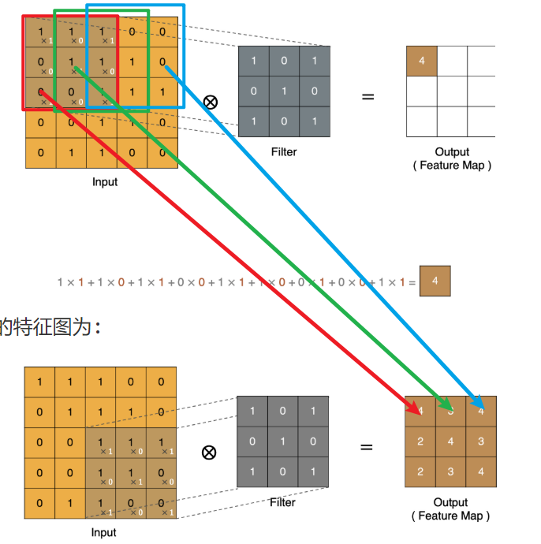

# 课堂笔记

## 正则化方法

### 什么是正则化

- 防止模型过拟合(训练集效果好, 测试集效果差), 提高模型泛化能力
- 一种防止过拟合, 提高模型泛化能力的策略
  - L1正则: 需要通过手动写代码实现  
  - L2正则: SGD(weight_decay=)
  - dropout
  - BN

###  Dropout正则化

- 让神经元以p概率随机死亡, 每批次样本训练模型时, 死亡的神经元都是随机, 防止预测结果受某个神经元影响(防止过拟合)

- p概率->[0.2, 0.5], 简单模型概率低, 复杂模型概率高

- 不失活的神经元计算结果除以(1-p), 让训练时输出结果和测试时(dropout不生效)结果一致

  - 训练模型 -> model.train()
  - 测试模型 -> model.eval()

- dropout是在激活层后使用

  ```python
  import torch
  import torch.nn as nn
  
  
  # dropout随机失活: 每批次样本训练时,随机让一部分神经元死亡,防止一些特征对结果影响大(防止过拟合)
  def dm01():
  	# todo:1-创建隐藏层输出结果
  	# float(): 转换成浮点类型张量
  	t1 = torch.randint(low=0, high=10, size=(1, 4)).float()
  	print('t1->', t1)
  	# todo:2-进行下一层加权求和计算
  	linear1 = nn.Linear(in_features=4, out_features=4)
  	l1 = linear1(t1)
  	print('l1->', l1)
  	# todo:3-进行激活值计算
  	output = torch.sigmoid(l1)
  	print('output->', output)
  	# todo:4-对激活值进行dropout处理  训练阶段
  	# p: 失活概率
  	dropout = nn.Dropout(p=0.4)
  	d1 = dropout(output)
  	print('d1->', d1)
  
  
  if __name__ == '__main__':
  	dm01()
  ```

### 批量归一正则化(Batch Normalization)

- 计算每个batch样本的均值和标准差, 利用均值和标准差计算出标准化的值

- 每个batch的均值和标准差都不一样, 会引入噪声样本数据, 降低训练模型效果(防止过拟合)

- 引入两个自学习的γ和β参数, 让每层的样本分布不一样(每层的激活函数可以不一样)

- 加速模型训练效果, 数据分布越均匀, 加权求和结果落入到合理区间(导数最大)

- 训练时进行标准化, 测试时不进行标准化

  ```python
  """
  正则化: 每批样本的均值和方差不一样, 引入噪声样本
  加快模型收敛: 样本标准化后, 落入激活函数的合理区间, 导数尽可能最大
  """
  import torch
  import torch.nn as nn
  
  
  # nn.BatchNorm1d(): 处理一维样本, 每批样本数最少是2个, 否则无法计算均值和标准差
  # nn.BatchNorm2d(): 处理二维样本, 图像(每个通道由二维矩阵组成), 计算二维矩阵每列均值和标准差
  # nn.BatchNorm3d(): 处理三维样本, 视频
  # 处理二维数据
  def dm01():
  	# todo:1-创建图像样本数据集 2个通道,每个通道3*4列特征图, 卷积层处理的特征图样本
  	# 数据集只有一张图像, 图像是由2个通道组成, 每个通道由3*4像素矩阵
  	input_2d = torch.randn(size=(1, 2, 3, 4))
  	print('input_2d->', input_2d)
  	# todo:2-创建BN层, 标准化 ->一定是在激活函数前进行标准化
  	# num_features: 输入样本的通道数
  	# eps: 小常数, 避免除0
  	# momentum: 指数移动加权平均值
  	# affine: 默认True, 引入可学习的γ和β参数
  	bn2d = nn.BatchNorm2d(num_features=2, eps=1e-5, momentum=0.1, affine=True)
  	ouput_2d = bn2d(input_2d)
  	print('ouput_2d->', ouput_2d)
  
  # 处理一维数据
  def dm02():
  	# 创建样本数据集
  	input_1d = torch.randn(size=(2, 2))
  	# 创建线性层
  	linear1 = nn.Linear(in_features=2, out_features=4)
  	l1 = linear1(input_1d)
  	print('l1->', l1)
  	# 创建BN层
  	bn1d = nn.BatchNorm1d(num_features=4)
  	# 对线性层的结果进行标准化处理
  	output_1d = bn1d(l1)
  	print('output_1d->', output_1d)
  
  
  
  if __name__ == '__main__':
  	# dm01()
  	dm02()
  ```

## 手机价格分类案例

### 案例需求

- 分类问题 0,1,2,3 四个类别
- 实现步骤
  - 准备数据集 -> 数据集分割, 转换成张量数据集
  - 构建神经网络模型 -> 继承nn.module
  - 模型训练
  - 模型评估

### 构建张量数据集

```python
# 导入相关模块
import torch
from torch.utils.data import TensorDataset
from torch.utils.data import DataLoader
import torch.nn as nn
from torchsummary import summary
import torch.optim as optim
from sklearn.model_selection import train_test_split
import numpy as np
import pandas as pd
import time


# todo:1-构建数据集
def create_dataset():
    print('===========================构建张量数据集对象===========================')
	# todo:1-1 加载csv文件数据集
	data = pd.read_csv('data/手机价格预测.csv')
	print('data.head()->', data.head())
	print('data.shape->', data.shape)
	# todo:1-2 获取x特征列数据集和y目标列数据集
	# iloc属性 下标取值
	x, y = data.iloc[:, :-1], data.iloc[:, -1]
	# 将特征列转换成浮点类型
	x = x.astype(np.float32)
	print('x->', x.head())
	print('y->', y.head())
	# todo:1-3 数据集分割 8:2
	x_train, x_valid, y_train, y_valid = train_test_split(x, y, train_size=0.8, random_state=88)
	# todo:1-4 数据集转换成张量数据集
	# x_train,y_train类型是df对象, df不能直接转换成张量对象
	# x_train.values():获取df对象的数据值, 得到numpy数组
	# torch.tensor(): numpy数组对象转换成张量对象
	train_dataset = TensorDataset(torch.tensor(data=x_train.values), torch.tensor(data=y_train.values))
	valid_dataset = TensorDataset(torch.tensor(data=x_valid.values), torch.tensor(data=y_valid.values))
	# todo:1-5 返回训练数据集, 测试数据集, 特征数, 类别数
	# shape->(行数, 列数) [1]->元组下标取值
	# np.unique()->去重 len()->去重后的长度 类别数
	print('x.shape[1]->', x.shape[1])
	print('len(np.unique(y)->', len(np.unique(y)))
	return train_dataset, valid_dataset, x.shape[1], len(np.unique(y))


if __name__ == '__main__':
	train_dataset, valid_dataset, input_dim, class_num = create_dataset()
```

### 构建分类神经网络模型

```python
# todo:2-构建神经网络分类模型
class PhonePriceModel(nn.Module):
	print('===========================构建神经网络分类模型===========================')
	# todo:2-1 构建神经网络  __init__()
	def __init__(self, input_dim, output_dim):
		# 继承父类的构造方法
		super().__init__()
		# 第一层隐藏层
		self.linear1 = nn.Linear(in_features=input_dim, out_features=128)
		# 第二层隐藏层
		self.linear2 = nn.Linear(in_features=128, out_features=256)
		# 输出层
		self.output = nn.Linear(in_features=256, out_features=output_dim)
	# todo:2-2 前向传播方法 forward()
	def forward(self, x):
		# 第一层隐藏层计算
		x = torch.relu(input=self.linear1(x))
		# 第二层隐藏层计算
		x = torch.relu(input=self.linear2(x))
		# 输出层计算
		# 没有进行softmax激活计算, 后续创建损失函数时CrossEntropyLoss=softmax+损失计算
		output = self.output(x)
		return output
# todo:3-模型训练
# todo:4-模型评估

if __name__ == '__main__':
	# 创建张量数据集对象
	train_dataset, valid_dataset, input_dim, class_num = create_dataset()
	# 创建模型对象
	model = PhonePriceModel(input_dim=input_dim, output_dim=class_num)
	# 计算模型参数
	# input_size: 输入层样本形状
	summary(model, input_size=(16, input_dim))
```

###  模型训练

```python
# todo:3-模型训练
def train(train_dataset, input_dim, class_num):
	print('===========================模型训练===========================')
	# todo:3-1 创建数据加载器 批量训练
	dataloader = DataLoader(dataset=train_dataset, batch_size=8, shuffle=True)
	# todo:3-2 创建神经网络分类模型对象, 初始化w和b
	model = PhonePriceModel(input_dim=input_dim, output_dim=class_num)
	print("======查看模型参数w和b======")
	for name, parameter in model.named_parameters():
		print(name, parameter)
	# todo:3-3 创建损失函数对象 多分类交叉熵损失=softmax+损失计算
	criterion = nn.CrossEntropyLoss()
	# todo:3-4 创建优化器对象 SGD
	optimizer = optim.SGD(params=model.parameters(), lr=1e-3)
	# todo:3-5 模型训练 min-batch 随机梯度下降
	# 训练轮数
	num_epoch = 50
	for epoch in range(num_epoch):
		# 定义变量统计每次训练的损失值, 训练batch数
		total_loss = 0.0
		batch_num = 0
		# 训练开始的时间
		start = time.time()
		# 批次训练
		for x, y in dataloader:
			# 切换模型模式
			model.train()
			# 模型预测 y预测值
			y_pred = model(x)
			# print('y_pred->', y_pred)
			# 计算损失值
			loss = criterion(y_pred, y)
			# print('loss->', loss)
			# 梯度清零
			optimizer.zero_grad()
			# 计算梯度
			loss.backward()
			# 更新参数 梯度下降法
			optimizer.step()
			# 统计每次训练的所有batch的平均损失值和和batch数
			# item(): 获取标量张量的数值
			total_loss += loss.item()
			batch_num += 1
		# 打印损失变换结果
		print('epoch: %4s loss: %.2f, time: %.2fs' % (epoch + 1, total_loss / batch_num, time.time() - start))
	# todo:3-6 模型保存, 将模型参数保存到字典, 再将字典保存到文件
	torch.save(model.state_dict(), 'model/phone.pth')


if __name__ == '__main__':
	# 创建张量数据集对象
	train_dataset, valid_dataset, input_dim, class_num = create_dataset()
	# 创建模型对象
	# model = PhonePriceModel(input_dim=input_dim, output_dim=class_num)
	# 计算模型参数
	# input_size: 输入层样本形状
	# summary(model, input_size=(16, input_dim))
	# 模型训练
	train(train_dataset=train_dataset, input_dim=input_dim, class_num=class_num)
```

### 模型评估

```python
# todo:4-模型评估
def test(valid_dataset, input_dim, class_num):
	# todo:4-1 创建神经网络分类模型对象
	model = PhonePriceModel(input_dim=input_dim, output_dim=class_num)
	# todo:4-2 加载训练模型的参数字典
	model.load_state_dict(torch.load(f='model/phone.pth'))
	# todo:4-3 创建测试集数据加载器
	# shuffle: 不需要为True, 预测, 不是训练
	dataloader = DataLoader(dataset=valid_dataset, batch_size=8, shuffle=False)
	# todo:4-4 定义变量, 初始值为0, 统计预测正确的样本个数
	correct = 0
	# todo:4-5 按batch进行预测
	for x, y in dataloader:
		print('y->', y)
		# 切换模型模式为预测模式
		model.eval()
		# 模型预测 y预测值 -> 输出层的加权求和值
		output = model(x)
		print('output->', output)
		# 根据加权求和值得到类别, argmax() 获取最大值对应的下标就是类别 y->0,1,2,3
		# dim=1:一行一行处理, 一个样本一个样本
		y_pred = torch.argmax(input=output, dim=1)
		print('y_pred->', y_pred)
		# 统计预测正确的样本个数
		print(y_pred == y)
		# 对布尔值求和, True->1 False->0
		print((y_pred == y).sum())
		correct += (y_pred == y).sum()
		print('correct->', correct)
	# 计算预测精度 准确率
	print('Acc: %.5f' % (correct.item() / len(valid_dataset)))


if __name__ == '__main__':
	# 创建张量数据集对象
	train_dataset, valid_dataset, input_dim, class_num = create_dataset()
	# 创建模型对象
	# model = PhonePriceModel(input_dim=input_dim, output_dim=class_num)
	# 计算模型参数
	# input_size: 输入层样本形状
	# summary(model, input_size=(16, input_dim))
	# 模型训练
	# train(train_dataset=train_dataset, input_dim=input_dim, class_num=class_num)
	# 模型评估
	test(valid_dataset=valid_dataset, input_dim=input_dim, class_num=class_num)
```

### 网络性能优化

- 输入层数据进行标准化
- 神经网络层数增加, 神经元个数增加
- 梯度下降优化方法由SGD调整为Aam
- 学习率由1e-3调整为1e-4
- 正则化
- 增加训练轮数
- ...

##  图像基础知识

### 3.1 图像概念

- 计算机中图像分类表示
  - 二值图像 1通道(1个二维矩阵) 像素值:0或1
  - 灰度图像 1通道 像素值:0-255
  - 索引图像 1通道 索引值->RGB二维矩阵行下标 彩色图像 像素值:0-255
  - RGB真彩色图像(最常用) 3通道(3个二维矩阵) R G B三个二维矩阵 像素值:0-255

###  图像加载

```python
import numpy as np
import matplotlib.pyplot as plt
import torch


# 创建全黑和全白图片
def dm01():
	# 全黑图片
	# 创建3通道二维矩阵, 黑色 0像素点
	# H W C: 200, 200, 3
	# 高 宽 通道
	img1 = np.zeros(shape=(200, 200, 3))
	print('img1->', img1)
	print('img1.shape->', img1.shape)
	# 展示图像
	plt.imshow(img1)
	plt.show()

	# 全白图片
    # 放到全连接层就是 200*200*3=120000个特征值的一维向量
	img2 = torch.full(size=(200, 200, 3), fill_value=255)
	print('img2->', img2)
	print('img2.shape->', img2.shape)
	# 展示图像
	plt.imshow(img2)
	plt.show()


def dm02():
	# 加载图片
	img1 = plt.imread(fname='data/img.jpg')
	print('img1->', img1)
	print('img1.shape->', img1.shape)
	# 保存图像
	plt.imsave(fname='data/img1.png', arr=img1)
	# 展示图像
	plt.imshow(img1)
	plt.show()


if __name__ == '__main__':
	# dm01()
	dm02()
```

## 卷积神经网络(CNN)介绍

### 什么是CNN

- 包含卷积层,池化层以及全连接层的神经网络计算模型
- 组成
  - 卷积层: 提取图像特征图
  - 池化层: 降维, 减少特征图的特征值, 减少模型参数
  - 全连接层: 进行预测, 只能接受二维数据集, 1个样本就是1维向量
    - 将池化层的特征图(1张图像)转换成一维 `200*200*3->120000个特征值`

### CNN应用场景

- 图像分类
- 目标检测
- 面部解锁
- 自动驾驶
- ...

## 卷积层

> 作用: 提取特征图

### 卷积计算

> 卷积计算等同于线性层加权求和计算

- 通过带有权重的卷积核和图像的特征值进行点乘运算, 得到新特征图上的一个特征值

- 卷积核/滤波器 -> 带有权重参数的神经元

- w1x1 + w2x2 + .... + b

  - w1->卷积核一个权重参数
  - x1->特征图的一个特征值(像素点)

  

### Padding(填充)

- 在原图像特征图周围补充特征值(默认补0)
- 作用
  - 使新特征图和原特征图形状保持一致
  - 减少边缘特征值信息丢失问题
    - 未padding, 边缘特征值只参与一次计算, 经过padding后, 边缘特征值参与多次计算
- 实现方式
  - 不进行padding处理: 新特征图比原图像特征图小
  - same padding: 原图像特征图形状和新特征图形状一致
  - full padding: 新特征图形状比原图像特征图大, 新增特征

### Stride(步长)

- stride指卷积核(神经元)在特征图上滑动的步伐 默认1
- 作用:
  - 减少计算量
  - 减少特征, 新特征图特征值减少(降维)
- 一般默认1, 可以设置2或4
- 原图像特征图`5*5`, stride=1->新特征图`3*3`, stride=2->新特征图`2*2`

### 多通道卷积计算

- RGB彩色图像是由3个通道组成 -> 3个二维矩阵, 每个矩阵分别代表R/G/B
- 卷积核通道数和原图像通道数一致
- 卷积计算 -> 对应通道二维矩阵进行卷积计算, 将每个通道卷积计算的结果加到一起, 得到新特征图的一个特征值
- 新特征图是1个二维矩阵, 不是3个二维矩阵

### 多卷积核卷积计算

- 有多少个卷积核就是有多少个神经元, 就会提取到多少个二维的特征图

### 特征图大小计算

- N = (W-F+2P)/S + 1
- N: 新特征图高或宽
- W: 原特征图高或宽
- F: 卷积核高或宽
- P: padding值
- S: stride值
- N如果为小数, 向下取整, 内部封装floor函数

### 卷积层API使用

```python
import torch
import torch.nn as nn
import matplotlib.pyplot as plt

"""
in_channels:原图像的通道数,RGB彩色图像是3
out_channels:卷积核/神经元个数 输出的新图像是由n个通道的二维矩阵组成
kernel_size:卷积核形状 (3,3) (3,5)
stride:步长 默认为1
padding:填充圈数 默认为0  1  same->stride=1  2,3...
nn.Conv2d(in_channels=,out_channels=,kernel_size=,stride=,padding=)
"""


def dm01():
	# todo:1-加载RGB彩色图像 (H,W,C)
	img = plt.imread(fname='data/img.jpg')
	print('img->', img)
	print('img.shape->', img.shape)
	# todo:2-将图像的形状(H,W,C)转换成(C,H,W)  permute()方法
	img2 = torch.tensor(data=img, dtype=torch.float32).permute(dims=(2, 0, 1))
	print('img2->', img2)
	print('img2.shape->', img2.shape)
	# todo:3-将这张图像保存到数据集中 (batch_size,C,H,W)  unsqueeze()方法
	# 数据集只有一个样本
	img3 = img2.unsqueeze(dim=0)
	print('img3->', img3)
	print('img3.shape->', img3.shape)
	# todo:4-创建卷积层对象, 提取特征图
	conv = nn.Conv2d(in_channels=3,
					 out_channels=4,
					 kernel_size=(3, 3),
					 stride=2,
					 padding=0)
	conv_img = conv(img3)
	print('conv_img->', conv_img)
	print('conv_img.shape->', conv_img.shape)

	# 查看提取到的4个特征图
	# 获取数据集中第一张图像
	img4 = conv_img[0]
	# 转换形状 (H,W,C)
	img5 = img4.permute(1, 2, 0)
	print('img5->', img5)
	print('img5.shape->', img5.shape)
	# img5->(H,W,C)
	# img5[:, :, 0]->第1个通道的二维矩阵特征图 第一个特征图
	feature1 = img5[:, :, 0].detach().numpy()
	plt.imshow(feature1)
	plt.show()


if __name__ == '__main__':
	dm01()
```

## 池化层

> 池化层没有神经元参与, 只是实现降维, 不进行特征提取

### 池化计算

- 卷积层提取到的特征图进行降维操作
- 最大池化 -> 二维矩阵中最大的特征作为输出特征
- 平均池化 -> 二维矩阵中平均特征值作为输出特征

###  多通道池化计算

- 池化只在高和宽维度计算, 通道维度不参与池化
- 卷积层提取到的特征图像有多少通道, 经过池化后还是多少通道

### 池化层API使用

```python
import torch
import torch.nn as nn
"""
最大池化
kernel_size:窗口形状大小, 不是神经元形状大小, 池化层没有神经元参与
nn.MaxPool2d(kernel_size=, stride=, padding=)
平均池化
nn.AVGPool2d(kernel_size=, stride=, padding=)
"""

# 单通道卷积层特征图池化
def dm01():
	# 创建1通道的3*3二维矩阵, 一张特征图
	inputs = torch.tensor([[[0, 1, 2], [3, 4, 5], [6, 7, 8]]], dtype=torch.float)
	print('inputs->', inputs)
	print('inputs.shape->', inputs.shape)
	# 创建池化层
	# kernel_size: 窗口的形状大小
	pool1 = nn.MaxPool2d(kernel_size=(2, 2), stride=1, padding=0)
	outputs = pool1(inputs)
	print('outputs->', outputs)
	print('outputs.shape->', outputs.shape)
	pool2 = nn.AvgPool2d(kernel_size=(2, 2), stride=1, padding=0)
	outputs = pool2(inputs)
	print('outputs->', outputs)
	print('outputs.shape->', outputs.shape)


# 多通道卷积层特征图池化
def dm02():
	# size(3,3,3)
	inputs = torch.tensor([[[0, 1, 2], [3, 4, 5], [6, 7, 8]],
						   [[10, 20, 30], [40, 50, 60], [70, 80, 90]],
						   [[11, 22, 33], [44, 55, 66], [77, 88, 99]]], dtype=torch.float)
	# 创建池化层
	# kernel_size: 窗口的形状大小
	pool1 = nn.MaxPool2d(kernel_size=(2, 2), stride=1, padding=0)
	outputs = pool1(inputs)
	print('outputs->', outputs)
	print('outputs.shape->', outputs.shape)
	pool2 = nn.AvgPool2d(kernel_size=(2, 2), stride=1, padding=0)
	outputs = pool2(inputs)
	print('outputs->', outputs)
	print('outputs.shape->', outputs.shape)


if __name__ == '__main__':
	# dm01()
	dm02()
```

