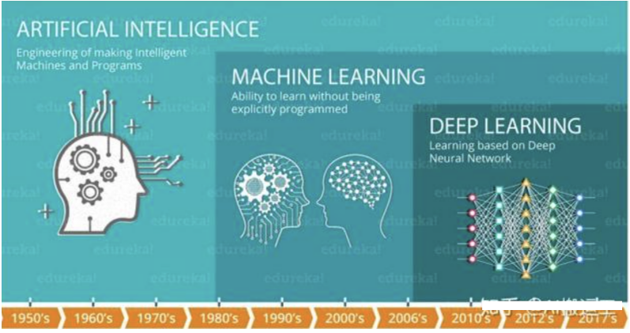
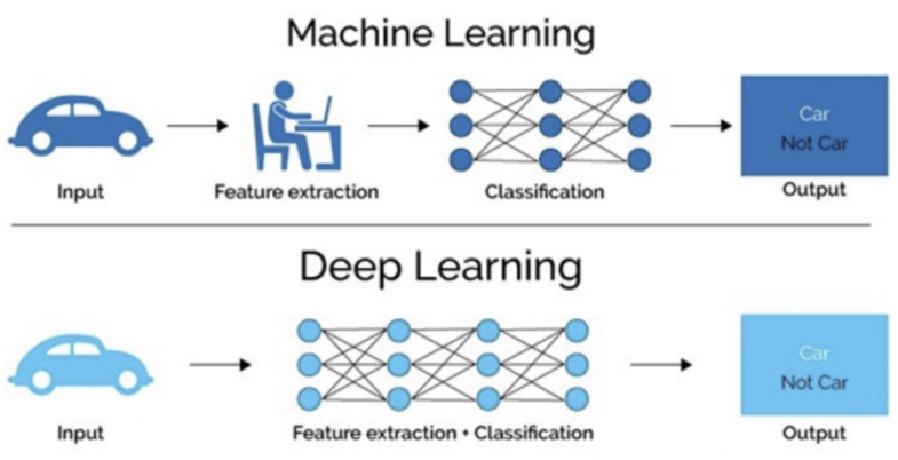
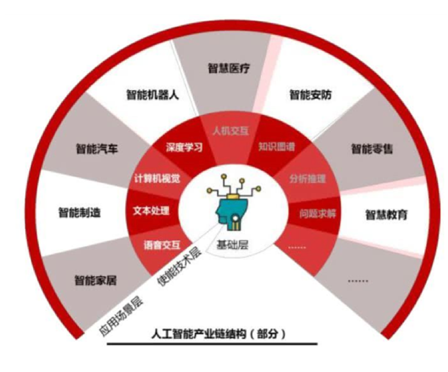
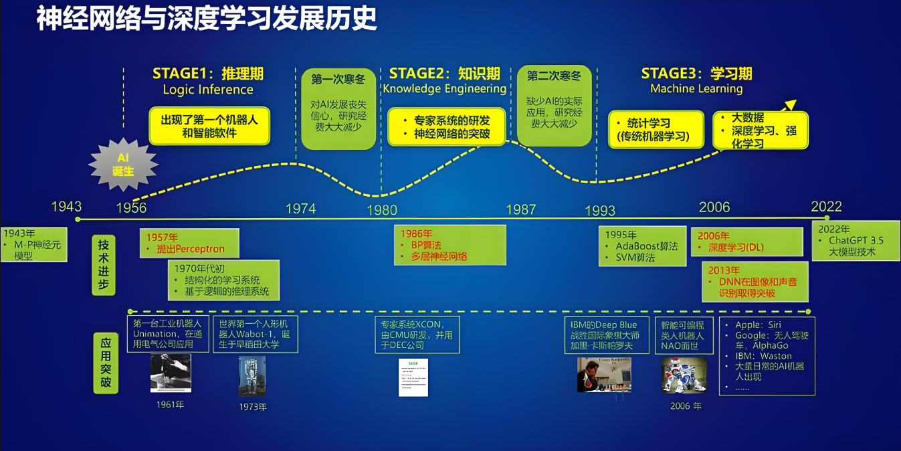

# 深度学习简介

## 什么是深度学习[知道]

**深度学习**（Deep Learning）是机器学习的分支，是一种以**人工神经网络为架构**，**对数据进行特征学习**的算法。深度学习中的形容词“深度”是指在网络中使用多层。

深度学习核心思想是==通过模仿人脑的神经网络来处理和分析复杂的数据，从大量数据中自动提取复杂特征==，擅长处理高维数据，如图像、语音和文本。

## 深度学习特点[知道]

- **多层非线性变换**：深度学习模型由多个层次组成，每一层都应用非线性激活函数对输入数据进行变换。较低的层级通常捕捉到简单的特征（如边缘、颜色等），而更高的层级则可以识别更复杂的模式（如物体或面部识别）。

- **自动特征提取**：与传统机器学习算法不同，深度学习能够自动从原始数据中学习到有用的特征，而不需要人工特征工程。这使得深度学习在许多领域中表现出色。

- **大数据和计算能力**：深度学习模型通常需要大量的标注数据和强大的计算资源（如GPU）来进行训练。大数据和高性能计算使得深度学习在图像识别、自然语言处理等领域取得了显著突破。
- **可解释性差**：深度学习模型内部的运作机制相对不透明，被称为“黑箱”，这意味着理解模型为什么做出特定决策可能会比较困难。这对某些应用场景来说是一个挑战。

## 常见的深度学习模型[了解]

- **卷积神经网络 (Convolutional Neural Networks, CNN)**：
  - 主要用于图像处理任务，如图像分类、目标检测、图像分割等。
  - 特点是使用卷积层来自动提取图像中的局部特征，并通过池化层减少参数数量，提高计算效率。
- **循环神经网络 (Recurrent Neural Networks, RNN)**：
  - 适用于处理序列数据，例如自然语言处理（NLP）、语音识别等。
  - RNN具有记忆功能，可以处理输入数据的时间依赖性，但标准RNN难以捕捉长期依赖关系。
- **自编码器 (Autoencoders)**：
  - 一种无监督学习模型，通常用于降维、特征学习或者异常检测。
  - 自编码器由编码器和解码器两部分组成，前者将输入压缩成一个较低维度的表示，后者尝试从这个低维表示重建原始输入。
- **生成对抗网络 (Generative Adversarial Networks, GAN)**：
  - 包含两个子网络：生成器和判别器。生成器负责创建看起来真实的假样本，而判别器则试图区分真假样本。
  - GAN广泛应用于图像生成、视频合成等领域。
- **Transformer**：
  - 主要用于自然语言处理（NLP）任务，尤其是机器翻译、文本生成等。
  - Transformer摒弃了传统的递归结构，采用自注意力机制（self-attention），使得它能够并行处理整个句子的信息，在机器翻译、文本摘要等任务中表现出色。

## 深度学习应用场景[了解]

- ==计算机视觉（Computer Vision）==

  - **图像分类**：将图像分为不同的类别。常用于人脸识别、物体检测等。
    - 自动标注社交媒体照片、医疗影像中的病变检测。
  - **目标检测（Object Detection）**：在图像或视频中定位并分类多个对象。
    - 自动驾驶中的行人检测、监控视频中的入侵检测。
  - **面部识别**：通过分析面部特征进行身份验证或分类。
    - 手机解锁、安防监控系统。

  - **图像生成**：基于输入生成新的图像，如风格转换、图像超分辨率等。
    - 艺术风格迁移、老旧照片修复。

- ==自然语言处理（Natural Language Processing, NLP）==

  - **机器翻译**：使用深度学习模型将一种语言的文本自动翻译成另一种语言。
    - Google翻译、实时语音翻译。
  - **情感分析**：分析文本中的情感倾向，如正面、负面或中性。
    - 社交媒体监控、产品评论分析。

  - **文本生成**：生成符合语法和语义的自然语言文本。
    - 自动写作助手、新闻生成。

  - **语音识别**：将语音转化为文字。
    - 智能助手（如Siri、Alexa）、自动字幕生成。
  - **聊天机器人（Chatbot）**：通过深度学习理解用户输入并生成合理的回应。
    - 客服机器人、虚拟助手（如GPT类模型）。

- ==推荐系统（Recommendation Systems）==

  - **电影、音乐推荐**：根据用户历史的评分和行为，推荐相关的电影、音乐或电视剧。
    - Netflix、Spotify的个性化推荐。
  - **电商推荐**：根据用户的购买历史和浏览习惯推荐商品。
    - 亚马逊、淘宝的商品推荐系统。
  - **社交媒体推荐**：分析用户的社交行为，推荐相关内容或朋友。
    - Facebook、Instagram的内容推荐。

  ...

##  深度学习发展史[了解]

- 早期探索

  - 20世纪40年代：沃尔特·皮茨（Walter Pitts）和沃伦·麦卡洛克（Warren McCulloch）等开始模仿生物神经系统来构建计算模型，如McCulloch-Pitts神经元
  - 1958年：弗兰克·罗森布拉特（Frank Rosenblatt）提出感知器概念，能够进行简单的二分类任务
  - 1960年代末：出现了多层感知器（MLP），但当时由于计算能力和数据量的限制，这些模型的应用受到很大限制
- 挑战与瓶颈

  - 1986年：**反向传播算法（Backpropagation）的提出标志着神经网络研究的一个重要突破。杰弗里·辛顿（Geoffrey Hinton）和大卫·鲁梅尔哈特**（David Rumelhart）等人提出了反向传播算法，使得多层神经网络（即深层网络）能够通过梯度下降优化参数，解决复杂的非线性问题。
  - 虽然神经网络方法在一些领域表现不错，但由于计算资源的限制以及对复杂数据（如图像和语音）的处理能力较弱，深度学习未能广泛应用。此时，**支持向量机（SVM）**、**决策树**等传统机器学习方法成为主流。
- 复兴与突破

  - **2006年**：**杰弗里·辛顿**和其团队提出了**深度信念网络（DBN）**，标志着深度学习的复兴。他们引入了无监督预训练的技术，使得深层网络能够有效训练。这为深度学习的发展奠定了基础。
  - **2012年**：深度学习的一个重要突破是**AlexNet**的出现。**亚历克斯·克里泽夫斯基**（Alex Krizhevsky）在**ImageNet图像分类竞赛**中使用了一个深度卷积神经网络，显著提升了图像分类的精度，比传统方法提高了20%以上。AlexNet的成功标志着深度学习在计算机视觉领域的成功应用。
  - **2014年**：生成对抗网络（**GANs**）由**伊恩·古德费洛**（Ian Goodfellow）等人提出，开启了生成模型的新时代，能够生成非常逼真的图像、音频和视频。
  - **2015年**：**ResNet**（残差网络）由**何凯明**（Kaiming He）等提出，解决了深度网络中的梯度消失和梯度爆炸问题，允许训练极深的网络（如50层、152层），极大推动了深度学习在图像识别任务中的应用。
- 爆发期
  - **2016年：**Google AlphaGo 战胜李世石（人工智能第三次浪潮），AlphaGo 展现了深度强化学习（Deep Reinforcement Learning）在解决复杂问题上的巨大潜力，将其推向了公众视野。
  - **2017年：**自然语言处理NLP的Transformer框架出现，奠定了后续预训练语言模型（如 BERT 和 GPT）的基础。
  - **2018年：**BERT和GPT的出现，基于Transformer架构的预训练语言模型的代表。
  - **2022年：**ChatGPT的出现，进入到大模型AIGC发展的阶段，开启了 AI 与人交互的新模式，使人们可以更容易地使用 AI 并从中受益。

