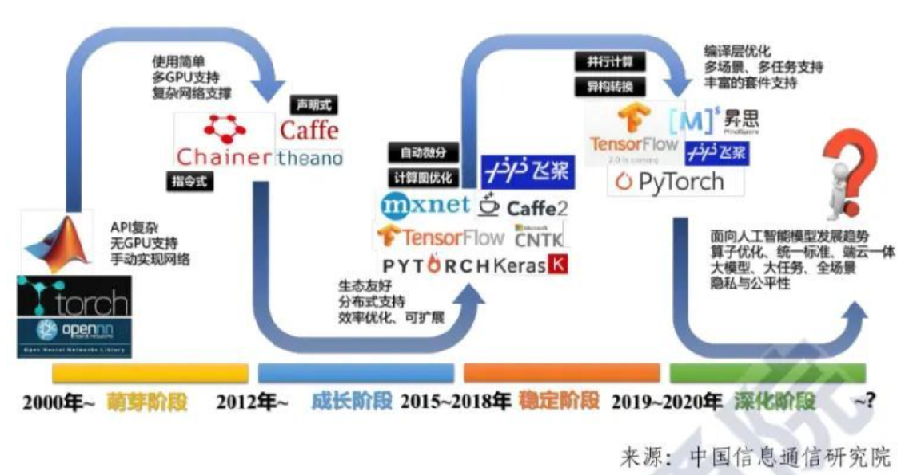
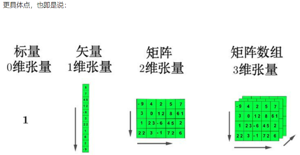
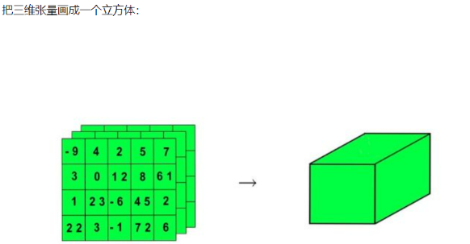
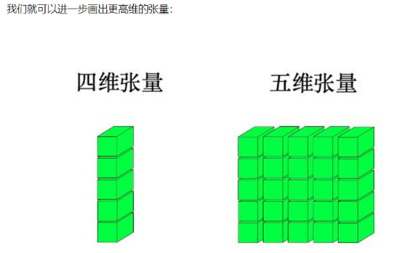
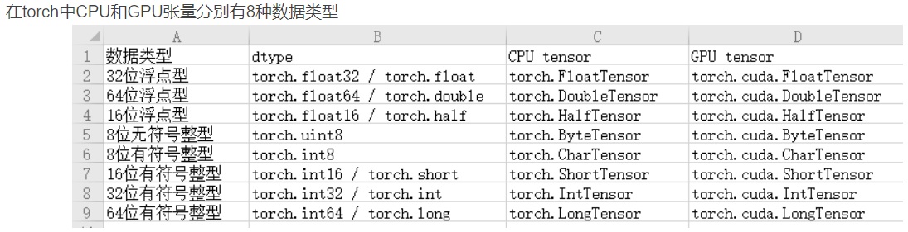
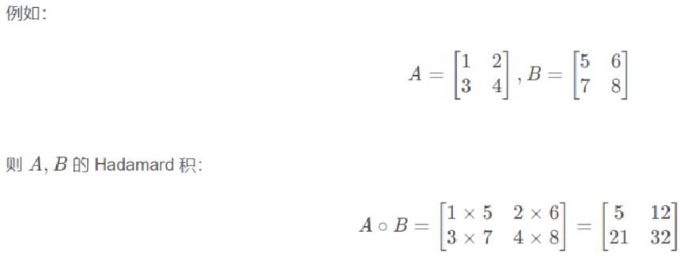
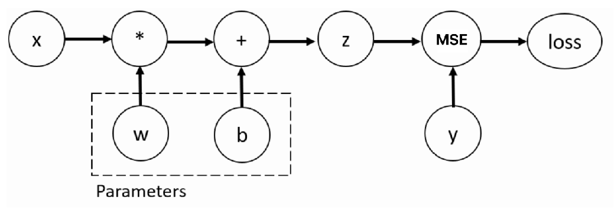
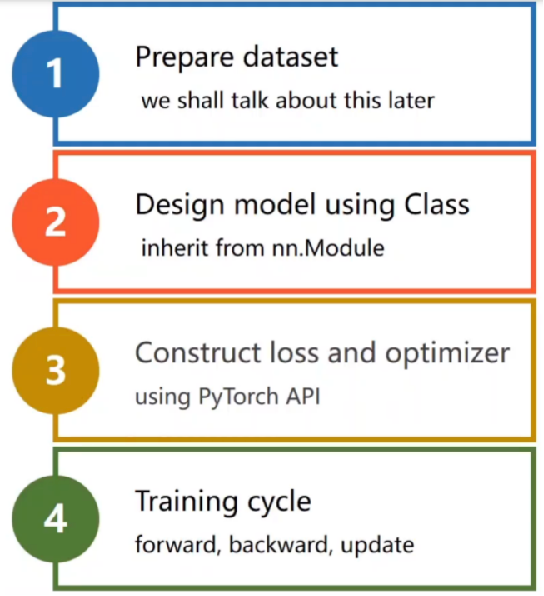
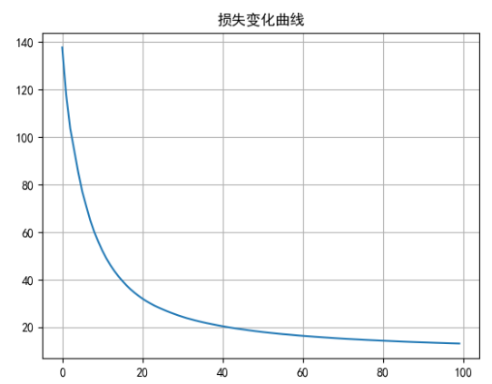
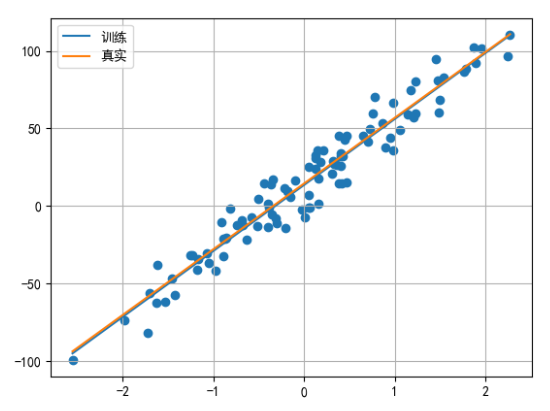

# PyTorch框架使用

## PyTorch框架简介

### 什么是PyTorch

> PyTorch是一个基于Python的科学计算包
>
> PyTorch安装
>
> ```sh
> pip install torch -i https://pypi.tuna.tsinghua.edu.cn/simple
> ```

- PyTorch一个基于Python语言的深度学习框架，它将数据封装成张量（Tensor）来进行处理。
- PyTorch提供了灵活且高效的工具，用于构建、训练和部署机器学习和深度学习模型。
- PyTorch广泛应用于学术研究和工业界，特别是在计算机视觉、自然语言处理、强化学习等领域。

### PyTorch特点

> **PyTorch与TensorFlow的比较**
>
> - **PyTorch与TensorFlow的区别**：PyTorch是基于动态图（动态计算图）的，而TensorFlow 1.x是基于静态计算图的（TensorFlow 2.x支持动态图）。这使得PyTorch在灵活性和调试方面优于TensorFlow，尤其是在研究和原型设计中。此外，PyTorch的API设计更加贴近Python，易于学习和使用。
> - **TensorFlow 2.x**（引入了Eager Execution）和PyTorch都支持动态图，但PyTorch因其更直观的编程模式和调试支持，在学术界和一些工业界应用中更为流行。

- **类似于NumPy的张量计算**
  - PyTorch中的基本数据结构是张量（Tensor），它与NumPy中的数组类似，但PyTorch的张量具有GPU加速的能力（通过CUDA），这使得深度学习模型能够高效地在GPU上运行。
- **自动微分系统**
  - PyTorch提供了强大的**自动微分**功能（`autograd`模块），能够自动计算模型中每个参数的梯度。
  - 自动微分使得梯度计算过程变得简洁和高效，并且支持复杂的模型和动态计算图。
- **深度学习库**
  - PyTorch提供了一个名为**torch.nn**的子模块，用于构建神经网络。它包括了大量的预构建的层（如全连接层、卷积层、循环神经网络层等），损失函数（如交叉熵、均方误差等），以及优化算法（如SGD、Adam等）。
  - `torch.nn.Module`是PyTorch中构建神经网络的基础类，用户可以通过继承该类来定义自己的神经网络架构。

- **动态计算图**
  - PyTorch使用动态计算图机制，允许在运行时构建和修改模型结构，具有更高的灵活性，适合于研究人员进行实验和模型调试。
- **GPU加速（CUDA支持）**
  - PyTorch提供对GPU的良好支持，能够在NVIDIA的CUDA设备上高效地进行计算。用户只需要将数据和模型转移到GPU上，PyTorch会自动优化计算过程。
  - 通过简单的`tensor.to(device)`方法，可以轻松地将模型和数据从CPU转移到GPU或从一个GPU转移到另一个GPU。
- **跨平台支持**
  - PyTorch支持在多种硬件平台（如CPU、GPU、TPU等）上运行，并且支持不同操作系统（如Linux、Windows、macOS）以及分布式计算环境（如多GPU、分布式训练）。

### PyTorch发展历史

- **Torch**

  Torch是最早的Torch框架，最初由Ronan Collobert、Clement Farabet等人开发。它是一个科学计算框架，提供了多维张量操作和科学计算工具。

- **Torch7**

  Torch7是Torch的一个后续版本，引入了Lua编程语言，并在深度学习领域取得了一定的成功。遗憾的是，随着pytorch的普及，Torch便不再维护，Torch7也就成为了Torch的最后一个版本。

- **Pytorch 0.1.0**

  在Torch的基础上，Facebook人工智能研究院（FAIR）于2016年发布了PyTorch的第一个版本，标志着PyTorch的正式诞生。

  初始版本的PyTorch主要基于Torch7，但引入了更加Pythonic的设计风格，使得深度学习模型的定义和调试更加直观和灵活。

- **Pytorch 0.2.0**

  该版本首次引入了动态图机制，使得用户能够在构建神经网络时更加灵活。作为Pytorch后期制胜tensorflow的关键机制，该版本象征着Pytorch进入了一个新的阶段。

- **Pytorch 1.0.0**

  2018年发布了Pytorch的首个稳定版本，引入了Eager模式简化了模型的构建和训练过程。

- **Pytorch 2.0**

  Pytorch2.0引入了torch.compile，可以支持对训练过程的加速，同时引入了TorchDynamo，主要替换torch.jit.trace和torch.jit.script。另外在这个版本中编译器性能大幅提升，分布式运行方面也做了一定的优化。



## 张量创建

### 什么是张量

> 张量是PyTorch中的核心数据抽象

- PyTorch中的张量就是元素为同一种数据类型的多维矩阵，与NumPy数组类似。

- PyTorch中，张量以"类"的形式封装起来，对张量的一些运算、处理的方法（数值计算、矩阵操作、自动求导）被封装在类中。



==多个二维张量组成三维张量==



==多个三维张量组成四维张量==

==多个四维张量组成五维张量==



### 基本创建方式

> - 张量的数据类型有
>
>   
>
> - 张量中默认的数据类型是**float32(torch.FloatTensor)**

- torch.tensor(data=, dtype=) 根据指定数据创建张量

  ```python
  import torch  # 需要安装torch模块
  import numpy as np
  
  
  # 1. 创建张量标量
  data = torch.tensor(10)
  print(data)
  # 2. numpy 数组, 由于data为float64, 张量元素类型也是float64
  data = np.random.randn(2, 3)
  data = torch.tensor(data)
  print(data)
  # 3. 列表, 浮点类型默认float32
  data = [[10., 20., 30.], [40., 50., 60.]]
  data = torch.tensor(data)
  print(data)
  ```

- torch.Tensor(size=) 根据形状创建张量, 其也可用来创建指定数据的张量

  ```python
  # 1. 创建2行3列的张量, 默认 dtype 为 float32
  data = torch.Tensor(2, 3)
  print(data)
  # 2. 注意: 如果传递列表, 则创建包含指定元素的张量
  data = torch.Tensor([10])
  print(data)
  data = torch.Tensor([10, 20])
  print(data)
  ```

- torch.IntTensor()/torch.FloatTensor() 创建指定类型的张量

  ```python
  # 1. 创建2行3列, dtype 为 int32 的张量
  data = torch.IntTensor(2, 3)
  print(data)
  # 2. 注意: 如果传递的元素类型不正确, 则会进行类型转换
  data = torch.IntTensor([2.5, 3.3])
  print(data)
  # 3. 其他的类型
  data = torch.ShortTensor()  # int16
  data = torch.LongTensor()   # int64
  data = torch.FloatTensor()  # float32
  data = torch.DoubleTensor() # float64
  ```

### 线性和随机张量

- torch.arange(start=, end=, step=)：固定步长线性张量

- torch.linspace(start=, end=, steps=)：固定元素数线性张量

  ```python
  # 1. 在指定区间按照步长生成元素 [start, end, step) 左闭右开
  data = torch.arange(0, 10, 2)
  print(data)
  
  # 2. 在指定区间按照元素个数生成 [start, end, steps] 左闭右闭
  # step = (end-start) / (steps-1)
  # value_i = start + step * i
  data = torch.linspace(0, 9, 10)
  print(data)
  ```

- torch.randn/rand(size=) 创建随机浮点类型张量

- torch.randint(low=, high=, size=) 创建随机整数类型张量 左闭右开

- torch.initial_seed() 和 torch.manual_seed(seed=) 随机种子设置

  ```python
  # 1. 创建随机张量
  data = torch.randn(2, 3)  # 创建2行3列张量
  print(data)
  # 查看随机数种子
  print('随机数种子:', torch.initial_seed())
  
  # 2. 随机数种子设置 
  torch.manual_seed(100)
  data = torch.randn(2, 3)
  print(data)
  print('随机数种子:', torch.initial_seed())
  ```

### 指定值张量

- torch.zeros(size=) 和 torch.zeros_like(input=) 创建全0张量

  ```python
  # 1. 创建指定形状全0张量
  data = torch.zeros(2, 3)
  print(data)
  
  # 2. 根据张量形状创建全0张量
  data = torch.zeros_like(data)
  print(data)
  ```

- torch.ones(size=) 和 torch.ones_like(input=) 创建全1张量

  ```python
  # 1. 创建指定形状全1张量
  data = torch.ones(2, 3)
  print(data)
  
  # 2. 根据张量形状创建全1张量
  data = torch.ones_like(data)
  print(data)
  ```

- torch.full(size=, fill_value=) 和 torch.full_like(input=, fill_value=) 创建全为指定值张量

  ```python
  # 1. 创建指定形状指定值的张量
  data = torch.full([2, 3], 10)
  print(data)
  
  # 2. 根据张量形状创建指定值的张量
  data = torch.full_like(data, 20)
  print(data)
  ```

### 指定元素类型张量

- data.type(dtype=)

  ```python
  data = torch.full([2, 3], 10)
  print(data.dtype)
  # 将 data 元素类型转换为 float64 类型
  data = data.type(torch.DoubleTensor)
  print(data.dtype)
  # 转换为其他类型
  # data = data.type(torch.ShortTensor)
  # data = data.type(torch.IntTensor)
  # data = data.type(torch.LongTensor)
  # data = data.type(torch.FloatTensor)
  # data = data.type(dtype=torch.float16)
  ```

- data.half/float/double/short/int/long()

  ```python
  data = torch.full([2, 3], 10)
  print(data.dtype)
  # 将 data 元素类型转换为 float64 类型
  data = data.double()
  print(data.dtype)
  # 转换为其他类型
  # data = data.short()
  # data = data.int()
  # data = data.long()
  # data = data.float()
  ```

## 张量类型转换

### 张量转换为NumPy数组

- 使用 t.numpy() 函数可以将张量转换为 ndarray 数组，但是共享内存，可以使用copy函数避免共享。

  ```python
  # 1. 将张量转换为 numpy 数组
  data_tensor = torch.tensor([2, 3, 4])
  # 使用张量对象中的 numpy 函数进行转换
  data_numpy = data_tensor.numpy()
  print(type(data_tensor))
  print(type(data_numpy))
  # 注意: data_tensor 和 data_numpy 共享内存
  # 修改其中的一个，另外一个也会发生改变
  # data_tensor[0] = 100
  data_numpy[0] = 100
  print(data_tensor)
  print(data_numpy)
  
  # 2. 对象拷贝避免共享内存
  data_tensor = torch.tensor([2, 3, 4])
  # 使用张量对象中的 numpy 函数进行转换，通过copy方法拷贝对象
  data_numpy = data_tensor.numpy().copy()
  print(type(data_tensor))
  print(type(data_numpy))
  # 注意: data_tensor 和 data_numpy 此时不共享内存
  # 修改其中的一个，另外一个不会发生改变
  # data_tensor[0] = 100
  data_numpy[0] = 100
  print(data_tensor)
  print(data_numpy)
  ```

### NumPy数组转换为张量

- 使用 torch.from_numpy(ndarray=) 可以将ndarray数组转换为 tensor张量，默认共享内存，使用copy函数避免共享。

- 使用 torch.tensor(data=) 可以将ndarray数组转换为tensor张量，默认不共享内存。

  ```python
  data_numpy = np.array([2, 3, 4])
  # 将 numpy 数组转换为张量类型
  # 1. torch.from_numpy(ndarray)
  data_tensor = torch.from_numpy(data_numpy)
  # nunpy 和 tensor 共享内存
  # data_numpy[0] = 100
  data_tensor[0] = 100
  print(data_tensor)
  print(data_numpy)
  
  # 2. torch.tensor(ndarray)
  data_numpy = np.array([2, 3, 4])
  data_tensor = torch.tensor(data_numpy)
  # nunpy 和 tensor 不共享内存
  # data_numpy[0] = 100
  data_tensor[0] = 100
  print(data_tensor)
  print(data_numpy)
  ```

### 提取标量张量的数值

- 对于只有一个元素的张量，使用item()函数将该值从张量中提取出来

  ```python
  # 当张量只包含一个元素时, 可以通过 item() 函数提取出该值
  data = torch.tensor([30,])
  print(data.item())
  data = torch.tensor(30)
  print(data.item())
  ```

## 张量数值计算

### 基本运算

加减乘除取负号：

- +、-、*、/、-

- add(other=)、sub、mul、div、neg 

- `add_(other=)`、`sub_`、`mul_`、`div_`、`neg_`（其中带下划线的版本会修改原数据）

  ```python
  data = torch.randint(0, 10, [2, 3])
  print(data)
  # 1. 不修改原数据
  new_data = data.add(10)  # 等价 new_data = data + 10
  print(new_data)
  # 2. 直接修改原数据 注意: 带下划线的函数为修改原数据本身
  data.add_(10)  # 等价 data += 10
  print(data)
  # 3. 其他函数
  print(data.sub(100))
  print(data.mul(100))
  print(data.div(100))
  print(data.neg())
  ```

### 点乘运算

> 点乘（Hadamard）也称为元素级乘积，指的是相同形状的张量对应位置的元素相乘，使用mul和运算符 * 实现。
>
> 

```python
data1 = torch.tensor([[1, 2], [3, 4]])
data2 = torch.tensor([[5, 6], [7, 8]])
# 第一种方式
data = torch.mul(data1, data2)
print(data)
# 第二种方式
data = data1 * data2
print(data)
```

###  矩阵乘法运算

> 矩阵乘法运算要求第一个矩阵 shape: (n, m)，第二个矩阵 shape: (m, p), 两个矩阵点积运算 shape 为: (n, p)。

- 运算符 @ 用于进行两个矩阵的乘积运算

- torch.matmul(input=, other=) 对进行乘积运算的两矩阵形状没有限定。对于输入shape不同的张量, 对应的最后几个维度必须符合矩阵运算规则

  ```python
  # 点积运算
  data1 = torch.tensor([[1, 2], [3, 4], [5, 6]])
  data2 = torch.tensor([[5, 6], [7, 8]])
  # 方式一:
  data3 = data1 @ data2
  print("data3-->", data3)
  # 方式二:
  data4 = torch.matmul(data1, data2)
  print("data4-->", data4)
  ```

## 张量运算函数

- `tensor.mean(dim=)`:平均值

- `tensor.sum(dim=)`:求和

- `tensor.min/max(dim=)`:最小值/最大值

- `tensor.pow(exponent=)`:幂次方 $$x^n$$

- `tensor.sqrt(dim=)`:平方根

- `tensor.exp()`:指数 $$e^x$$

- `tensor.log(dim=)`:对数 以e为底

- dim=0按列计算,dim=1按行计算

  ```python
  import torch
  
  
  data = torch.randint(0, 10, [2, 3], dtype=torch.float64)
  print(data)
  # 1. 计算均值
  # 注意: tensor 必须为 Float 或者 Double 类型
  print(data.mean())
  print(data.mean(dim=0))  # 按列计算均值
  print(data.mean(dim=1))  # 按行计算均值
  # 2. 计算总和
  print(data.sum())
  print(data.sum(dim=0))
  print(data.sum(dim=1))
  # 3. 计算平方
  print(torch.pow(data，2))
  # 4. 计算平方根
  print(data.sqrt())
  # 5. 指数计算, e^n 次方
  print(data.exp())
  # 6. 对数计算
  print(data.log())  # 以 e 为底
  print(data.log2())
  print(data.log10())
  ```

## 张量索引操作

> 我们在操作张量时，经常需要去获取某些元素就进行处理或者修改操作，在这里我们需要了解在torch中的索引操作。

```python
import torch


# 随机生成数据
data = torch.randint(0, 10, [4, 5])
print(data)

# 1.简单行、列索引
print(data[0])
print(data[:, 0])

# 2.列表索引
# 返回 (0, 1)、(1, 2) 两个位置的元素
print(data[[0, 1], [1, 2]])
# 返回 0、1 行的 1、2 列共4个元素
print(data[[[0], [1]], [1, 2]])


# 3.范围索引
# 前3行的前2列数据
print(data[:3, :2])
# 第2行到最后的前2列数据
print(data[2:, :2])

# 4.布尔索引
# 第三列大于5的行数据
print(data[data[:, 2] > 5])
# 第二行大于5的列数据
print(data[:, data[1] > 5])

# 5.多维索引
# 随机生成三维数据
data = torch.randint(0, 10, [3, 4, 5])
print(data)
# 获取0轴上的第一个数据
print(data[0, :, :])
# 获取1轴上的第一个数据
print(data[:, 0, :])
# 获取2轴上的第一个数据
print(data[:, :, 0])
```

## 张量形状操作

> 张量形状操作是指对张量的维度进行变换的一系列操作。
>
> 张量的形状则描述了每个维度上的元素数量。

###  reshape

> 保证张量数据不变的前提下改变数据的维度

```python
import torch

data = torch.tensor([[10, 20, 30], [40, 50, 60]])
# 1. 使用 shape 属性或者 size 方法都可以获得张量的形状
print(data.shape, data.shape[0], data.shape[1])
print(data.size(), data.size(0), data.size(1))

# 2. 使用 reshape 函数修改张量形状
new_data = data.reshape(1, 6)
print(new_data.shape)
```

### squeeze和unsqueeze

> squeeze：删除指定位置形状为1的维度，不指定位置删除所有形状为1的维度，==降维==
>
> unsqueeze：在指定位置添加形状为1的维度，==升维==

```python
mydata1 = torch.tensor([1, 2, 3, 4, 5])             
print('mydata1--->', mydata1.shape, mydata1) # 一个普通的数组 1维数据
mydata2 = mydata1.unsqueeze(dim=0)
print('在0维度上 拓展维度：', mydata2, mydata2.shape)  # 1*5
mydata3 = mydata1.unsqueeze(dim=1)
print('在1维度上 拓展维度：', mydata3, mydata3.shape)  # 5*1
mydata4 = mydata1.unsqueeze(dim=-1)
print('在-1维度上 拓展维度：', mydata4, mydata4.shape) # 5*1
mydata5 = mydata4.squeeze()
print('压缩维度：', mydata5, mydata5.shape)  # 1*5
```

### transpose和permute

> transpose：实现交换张量形状的指定维度, 例如: 一个张量的形状为 (2, 3, 4) ，把 3 和 4 进行交换, 将张量的形状变为 (2, 4, 3) 
>
> permute：一次交换更多的维度

```python
data = torch.tensor(np.random.randint(0, 10, [3, 4, 5]))
print('data shape:', data.size())
# 1. 交换1和2维度
mydata2 = torch.transpose(data, 1, 2)
print('mydata2.shape--->', mydata2.shape)
# 2. 将data 的形状修改为 (4, 5, 3), 需要变换多次
mydata3 =  torch.transpose(data, 0, 1)
mydata4 = torch.transpose(mydata3, 1, 2)
print('mydata4.shape--->', mydata4.shape)
# 3. 使用 permute 函数将形状修改为 (4, 5, 3)
# 3-1 方法1
mydata5 = torch.permute(data, [1, 2, 0])
print('mydata5.shape--->', mydata5.shape)
# 3-2 方法2
mydata6 = data.permute([1, 2, 0])
print('mydata6.shape--->', mydata6.shape)
```

### view和contiguous

> view函数也可以用于修改张量的形状，只能用于修改连续的张量。在PyTorch中，有些张量的底层数据在内存中的存储顺序与其在张量中的逻辑顺序不一致，view函数无法对这样的张量进行变形处理，例如: 一个张量经过了 transpose 或者 permute 函数的处理之后，就无法使用 view 函数进行形状操作。 
>
> contiguous：将不连续张量转为连续张量
>
> is_contiguous：判断张量是否连续,返回True或False

```python
# 1 一个张量经过了 transpose 或者 permute 函数的处理之后，就无法使用 view 函数进行形状操作
# 若要使用view函数, 需要使用contiguous() 变成连续以后再使用view函数
# 2 判断张量是否连续
data = torch.tensor([[10, 20, 30],[40, 50, 60]])
print('data--->', data, data.shape)
# 1 判断张量是否连续
print(data.is_contiguous()) # True
# 2 view
mydata2 = data.view(3, 2)
print('mydata2--->', mydata2, mydata2.shape)
# 3 判断张量是否连续
print('mydata2.is_contiguous()--->', mydata2.is_contiguous())
# 4 使用 transpose 函数修改形状
mydata3 = torch.transpose(data, 0, 1)  
print('mydata3--->', mydata3, mydata3.shape)
print('mydata3.is_contiguous()--->', mydata3.is_contiguous())
# 5 需要先使用 contiguous 函数转换为连续的张量，再使用 view 函数
print (mydata3.contiguous().is_contiguous())
mydata4 = mydata3.contiguous().view(2, 3)
print('mydata4--->', mydata4.shape, mydata4)
```

## 张量拼接操作

> 张量拼接操作用于组合来自不同来源或经过不同处理的数据。

### cat/concat

> 沿着现有维度连接一系列张量。所有输入张量除了指定的拼接维度外，其他维度必须匹配。

```python
import torch


data1 = torch.randint(0, 10, [1, 2, 3])
data2 = torch.randint(0, 10, [1, 2, 3])
print(data1)
print(data2)
# 1. 按0维度拼接
new_data = torch.cat([data1, data2], dim=0)
print(new_data)
print(new_data.shape)
# 2. 按1维度拼接
new_data = torch.cat([data1, data2], dim=1)
print(new_data)
print(new_data.shape)
# 3. 按2维度拼接
new_data = torch.cat([data1, data2], dim=2)
print(new_data)
print(new_data.shape)
```

### stack

> 在一个新的维度上连接一系列张量，这会增加一个新维度，并且所有输入张量的形状必须完全相同。

```python
import torch
data1 = torch.randint(0, 10, [2, 3])
data2 = torch.randint(0, 10, [2, 3])
print(data1)
print(data2)
# 1. 在0维度上拼接
new_data = torch.stack([data1, data2], dim=0)
print(new_data)
print(new_data.shape)
# 2. 在1维度上拼接
new_data = torch.stack([data1, data2], dim=1)
print(new_data)
print(new_data.shape)
# 3. 在2维度上拼接
new_data = torch.stack([data1, data2], dim=2)
print(new_data)
print(new_data.shape)
```

## 自动微分模块

> 自动微分就是自动计算梯度值,也就是计算导数。

- 什么是梯度
  - 对函数求导的值就是梯度
- 什么是梯度下降法
  - 是一种求最优梯度值的方法,使得损失函数的值最小
- 梯度经典语录
  - **对函数求导得到的值就是梯度** （在数值上的理解）
    - 在某一个点上，对函数求导得到的值就是该点的梯度
    - 没有点就无法求导,没有梯度
  - **梯度就是上山下山最快的方向** （在方向上理解)
  - **在平面内，梯度就是某一点上的斜率** 
    - y = 2x^2 某一点x=1的梯度，就是这一点上的斜率
  - **反向传播传播的是梯度**
    - 反向传播利用链式法则不断的从后向前求导，求出来的值就是梯度，所以大家都经常说反向传播传播的是梯度
  - **链式法则中，梯度相乘，就是传说中的梯度传播**

训练神经网络时，最常用的算法就是反向传播。在该算法中，参数（模型权重）会根据损失函数关于对应参数的梯度进行调整。为了计算这些梯度，PyTorch内置了名为 torch.autograd 的微分模块。它支持任意计算图的自动梯度计算：



接下来我们使用这个结构进行自动微分模块的介绍，我们使用 backward 方法、grad 属性来实现梯度的计算和访问。

### 梯度基本计算

> - ==pytorch不支持向量张量对向量张量的求导,只支持标量张量对向量张量的求导==
>   - x如果是张量,y必须是标量(一个值)才可以进行求导
> - 计算梯度: `y.backward()`, y是一个标量
> - 获取x点的梯度值: `x.grad`, 会累加上一次的梯度值

- 标量张量梯度计算

  ```python
  # 定义一个标量张量(点)
  # requires_grad=:默认为False,不会自动计算梯度;为True的话是将自动计算的梯度值保存到grad中
  x = torch.tensor(10, requires_grad=True, dtype=torch.float32)
  print("x-->", x)
  
  # 定义一个曲线
  y = 2 * x ** 2
  print("y-->", y)
  # 查看梯度函数类型,即曲线函数类型
  print(y.grad_fn)
  
  # 计算x点的梯度
  # 此时y是一个标量,可以不用使用y.sum()转换成标量
  print("y.sum()-->", y.sum())
  # y'|(x=10) = (2*x**2)'|(x=10) = 4x|(x=10) = 40
  y.sum().backward()
  
  # 打印x的梯度值
  print("x的梯度值是:", x.grad)
  ```

- 向量张量梯度计算

  ```python
  # 定义一个向量张量(点)
  x = torch.tensor([10, 20], requires_grad=True, dtype=torch.float32)
  print("x-->", x)
  
  # 定义一个曲线
  y = 2 * x ** 2
  print("y-->", y)
  
  # 计算梯度
  # x和y都是向量张量,不能进行求导,需要将y转换成标量张量-->y.sum()
  # y'|(x=10) = (2*x**2)'|(x=10) = 4x|(x=10) = 40
  # y'|(x=20) = (2*x**2)'|(x=20) = 4x|(x=20) = 80
  y.sum().backward()
  
  # 打印x的梯度
  print("x.grad-->", x.grad)
  ```

###  梯度下降法求最优解

- 梯度下降法公式: `w = w - r * grad` (r是学习率, grad是梯度值)

- 清空上一次的梯度值: `x.grad.zero_()`

  ```python
  # 求 y = x**2 + 20 的极小值点 并打印y是最小值时 w的值(梯度)
  # 1 定义点 x=10 requires_grad=True  dtype=torch.float32
  # 2 定义函数 y = x**2 + 20
  # 3 利用梯度下降法 循环迭代1000 求最优解
  # 3-1 正向计算(前向传播)
  # 3-2 梯度清零 x.grad.zero_()
  # 3-3 反向传播
  # 3-4 梯度更新 x.data = x.data - 0.01 * x.grad
  
  
  # 1 定义点x=10 requires_grad=True  dtype=torch.float32
  x = torch.tensor(10, requires_grad=True, dtype=torch.float32)
  
  # 2 定义函数 y = x ** 2 + 20
  y = x ** 2 + 20
  print('开始 权重x初始值:%.6f (0.01 * x.grad):无 y:%.6f' % (x, y))
  
  # 3 利用梯度下降法 循环迭代1000 求最优解
  for i in range(1, 1001):
  
      # 3-1 正向计算(前向传播)
      y = x ** 2 + 20
  
      # 3-2 梯度清零 x.grad.zero_()
      # 默认张量的 grad 属性会累加历史梯度值 需手工清零上一次的提取
      # 一开始梯度不存在, 需要做判断
      if x.grad is not None:
          x.grad.zero_()
  
      # 3-3 反向传播
      y.sum().backward()
  
      # 3-4 梯度更新 x.data = x.data - 0.01 * x.grad
      # x.data是修改原始x内存中的数据,前后x的内存空间一样;如果使用x,此时修改前后x的内存空间不同
      x.data = x.data - 0.01 * x.grad  # 注：不能 x = x - 0.01 * x.grad 这样写
  
      print('次数:%d 权重x: %.6f, (0.01 * x.grad):%.6f y:%.6f' % (i, x, 0.01 * x.grad, y))
          
  print('x：', x, x.grad, 'y最小值', y)
  ```

### 梯度计算注意点

- 不能将自动微分的张量转换成numpy数组，会发生报错，可以通过detach()方法实现

  ```python
  # 定义一个张量
  x1 = torch.tensor([10, 20], requires_grad=True, dtype=torch.float64)
  
  # 将x张量转换成numpy数组
  # 发生报错,RuntimeError: Can't call numpy() on Tensor that requires grad. Use tensor.detach().numpy() instead.
  # 不能将自动微分的张量转换成numpy数组
  # print(x1.numpy())
  
  # 通过detach()方法产生一个新的张量,作为叶子结点
  x2 = x1.detach()
  # x1和x2张量共享数据,但是x2不会自动微分
  print(x1.requires_grad)
  print(x2.requires_grad)
  # x1和x2张量的值一样,共用一份内存空间的数据
  print(x1.data)
  print(x2.data)
  print(id(x1.data))
  print(id(x2.data))
  
  # 将x2张量转换成numpy数组
  print(x2.numpy())
  ```

### 自动微分模块应用

```python
import torch

# 输入张量 2*5
x = torch.ones(2, 5)
# 目标值是 2*3    
y = torch.zeros(2, 3)
# 设置要更新的权重和偏置的初始值
w = torch.randn(5, 3, requires_grad=True)
b = torch.randn(3, requires_grad=True)
# 设置网络的输出值
z = torch.matmul(x, w) + b  # 矩阵乘法
# 设置损失函数，并进行损失的计算
loss = torch.nn.MSELoss()
loss = loss(z, y)
# 自动微分
loss.backward()
# 打印 w,b 变量的梯度
# backward 函数计算的梯度值会存储在张量的 grad 变量中
print("W的梯度:", w.grad)
print("b的梯度", b.grad)
```

## PyTorch构建线性回归模型

我们使用 PyTorch 的各个组件来构建线性回归模型。在pytorch中进行模型构建的整个流程一般分为四个步骤：

- 准备训练集数据
- 构建要使用的模型
- 设置损失函数和优化器
- 模型训练



要使用的API：

- 使用 PyTorch 的 nn.MSELoss() 代替平方损失函数
- 使用 PyTorch 的 data.DataLoader 代替数据加载器
- 使用 PyTorch 的 optim.SGD 代替优化器
- 使用 PyTorch 的 nn.Linear 代替假设函数

```python
import torch
from torch.utils.data import TensorDataset  # 构造数据集对象
from torch.utils.data import DataLoader  # 数据加载器
from torch import nn  # nn模块中有平方损失函数和假设函数
from torch import optim  # optim模块中有优化器函数
from sklearn.datasets import make_regression  # 创建线性回归模型数据集
import matplotlib.pyplot as plt


plt.rcParams['font.sans-serif'] = ['SimHei']  # 用来正常显示中文标签
plt.rcParams['axes.unicode_minus'] = False  # 用来正常显示负号


# 构造数据集
def create_dataset():
    x, y, coef = make_regression(n_samples=100,
                                 n_features=1,
                                 noise=10,
                                 coef=True,
                                 bias=14.5,
                                 random_state=0)

    # 将构建数据转换为张量类型
    x = torch.tensor(x)
    y = torch.tensor(y)

    return x, y, coef


# 训练模型
def train():
    # 构造数据集
    x, y, coef = create_dataset()

    # 构造数据集对象
    dataset = TensorDataset(x, y)

    # 构造数据加载器
    # dataset=:数据集对象
    # batch_size=:批量训练样本数据
    # shuffle=:样本数据是否进行乱序
    dataloader = DataLoader(dataset=dataset, batch_size=16, shuffle=True)

    # 构造模型
    # in_features指的是输入的二维张量的大小，即输入的[batch_size, size]中的size
    # out_features指的是输出的二维张量的大小，即输出的[batch_size，size]中的size
    model = nn.Linear(in_features=1, out_features=1)

    # 构造平方损失函数
    criterion = nn.MSELoss()

    # 构造优化函数
    # params=model.parameters():训练的参数,w和b
    # lr=1e-2:学习率, 1e-2为10的负二次方
    print("w和b-->", list(model.parameters()))
    print("w-->", model.weight)
    print("b-->", model.bias)
    optimizer = optim.SGD(params=model.parameters(), lr=1e-2)

    # 初始化训练次数
    epochs = 100
    # 损失的变化
    epoch_loss = [] 
    total_loss=0.0 
    train_sample=0.0
    for _ in range(epochs):
        for train_x, train_y in dataloader:
            # 将一个batch的训练数据送入模型
            y_pred = model(train_x.type(torch.float32))
            # 计算损失值,均方误差,当前批次所有样本的平均误差 
            loss = criterion(y_pred, train_y.reshape(-1, 1).type(torch.float32))
            total_loss += loss.item() 
            # loss是平均误差,所以样本数+1
            train_sample += 1
            # 梯度清零
            optimizer.zero_grad()
            # 自动微分(反向传播)
            loss.backward()
            # 更新参数
            optimizer.step()
        # 计算所有batch的平均误差作为当前epoch的误差 
        epoch_loss.append(total_loss/train_sample)
        
    # 打印回归模型的w
    print(model.weight)
    # 打印回归模型的b
    print(model.bias)
    
    # 绘制损失变化曲线 
    plt.plot(range(epochs), epoch_loss) 
    plt.title('损失变化曲线') 
    plt.grid() 
    plt.show()

    # 绘制拟合直线
    plt.scatter(x, y)
    x = torch.linspace(x.min(), x.max(), 1000)
    y1 = torch.tensor([v * model.weight + model.bias for v in x])
    y2 = torch.tensor([v * coef + 14.5 for v in x])
    plt.plot(x, y1, label='训练')
    plt.plot(x, y2, label='真实')
    plt.grid()
    plt.legend()
    plt.show()


if __name__ == '__main__':
    train()
```





​	