# 卷积神经网络CNN

## 图像基础知识

###  图像基本概念

图像是人类视觉的基础，是自然景物的客观反映，是人类**认识世界和人类本身**的重要源泉。**“图”是物体反射或透射光的分布，“像“是人的视觉系统所接受的图在人脑中所形成的印象或认识**，[照片](https://baike.baidu.com/item/%E7%85%A7%E7%89%87/1465692?fromModule=lemma_inlink)、绘画、剪贴画、地图、书法作品、手写汉字、传真、卫星云图、影视画面、X光片、脑电图、[心电图](https://baike.baidu.com/item/%E5%BF%83%E7%94%B5%E5%9B%BE/399200?fromModule=lemma_inlink)等都是图像。

在计算机中，按照颜色和灰度的多少可以将图像分为四种基本类型。

- **二值图像**

  一幅二值图像的二维[矩阵](https://so.csdn.net/so/search?q=%E7%9F%A9%E9%98%B5&spm=1001.2101.3001.7020)仅由0、1两个值构成，**“0”代表黑色，“1”代白色**。由于每一像素（矩阵中每一元素）取值仅有0、1两种可能，所以计算机中二值图像的数据类型通常为1个二进制位。二值图像通常用于文字、线条图的扫描识别（OCR）和掩膜图像的存储。

  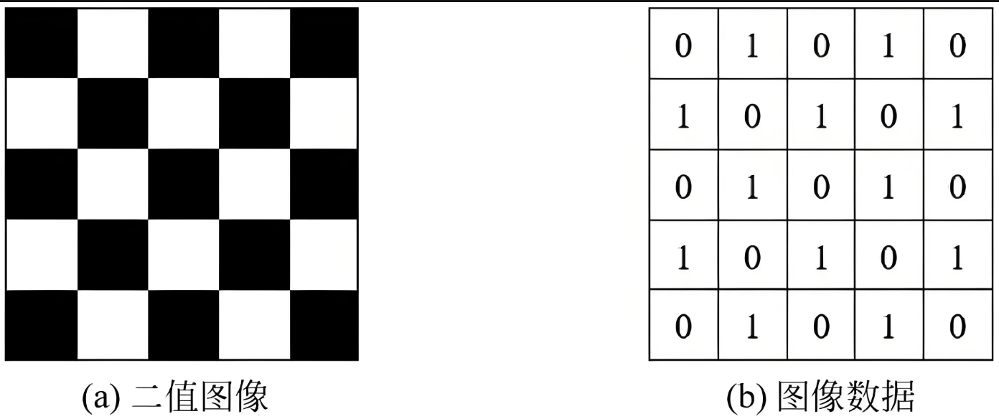

- **灰度图像**

  **灰度图像矩阵元素的取值范围通常为[0，255]**。因此其数据类型一般为**8位无符号整数的（int8）**，这就是人们经常提到的256灰度图像。**“0”表示纯黑色，“255”表示纯白色，中间的数字从小到大表示由黑到白的过渡色。**二值图像可以看成是灰度图像的一个特例。

- **索引图像**

  索引图像的文件结构比较复杂，除了**存放图像的二维矩阵**外，还包括一个称之为**颜色索引矩阵MAP的二维数组**。MAP的大小由存放图像的矩阵元素值域决定，如矩阵元素值域为[0，255]，则MAP矩阵的大小为256Ⅹ3，**用MAP=[RGB]表示**。**MAP中每一行的三个元素分别指定该行对应颜色的红、绿、蓝单色值，MAP中每一行对应图像矩阵像素的一个灰度值**，如某一像素的灰度值为64，则该像素就与MAP中的第64行建立了映射关系，该像素在屏幕上的实际颜色由第64行的[RGB]组合决定。也就是说，图像在屏幕上显示时，每一像素的颜色由存放在矩阵中该像素的灰度值作为索引通过检索颜色索引矩阵MAP得到。

  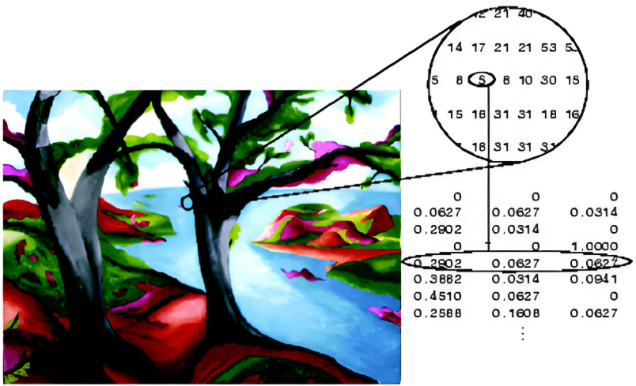

- **真彩色RGB图像**

  RGB图像与索引图像一样都可以用来表示彩色图像。与索引图像一样，它分别用红（R）、绿（G）、蓝（B）三原色的组合来表示每个像素的颜色。但与索引图像不同的是，**RGB图像每一个像素的颜色值（由RGB三原色表示）直接存放在图像矩阵中**，由于每一像素的颜色需由R、G、B三个分量来表示，**M、N分别表示图像的行列数，三个M x N的二维矩阵分别表示各个像素的R、G、B三个颜色分量。**RGB图像的数据类型一般为8位无符号整形。**注意：通道的顺序是 BGR 而不是 RGB。**

  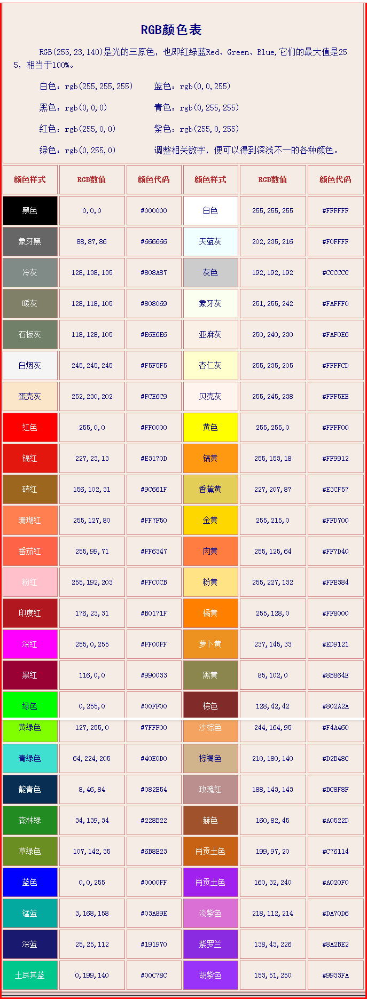

  | 图像类型     | 通道数           | 像素值范围       | 主要特点                                 | 常见用途                         |
  | ------------ | ---------------- | ---------------- | ---------------------------------------- | -------------------------------- |
  | **二值图像** | 1通道            | 0 或 1           | 每个像素只有黑与白两种值                 | 形态学操作、二值化、轮廓检测     |
  | **灰度图像** | 1通道            | 0 到 255         | 每个像素表示灰度（亮度）                 | 图像预处理、物体检测、人脸识别   |
  | **索引图像** | 1通道            | 0 到 255（索引） | 像素值为颜色表的索引，颜色表决定实际颜色 | 存储压缩、较少颜色的图像表示     |
  | **RGB图像**  | 3通道（R、G、B） | 0 到 255         | 每个像素由红、绿、蓝三个通道组成         | 普通彩色图像显示、图像处理与分析 |

  简单的讲：**图像是由像素点组成的，每个像素点的取值范围为: [0, 255] 。像素值越接近于0，颜色越暗，接近于黑色；像素值越接近于255，颜色越亮，接近于白色。**

  在深度学习中，我们使用的图像大多是彩色图，彩色图由RGB3个通道组成，如下图所示：

  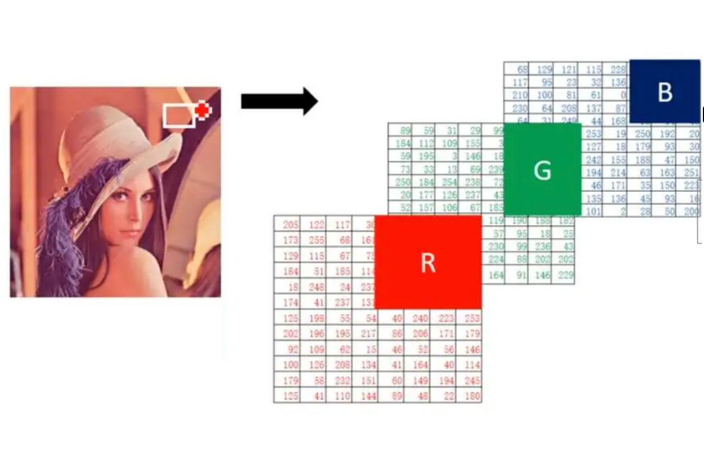

###  图像加载

使用 matplotlib 库来实际理解下上面讲解的图像知识。

```python
import numpy as np
import matplotlib.pyplot as plt


# 像素值的理解
def test01():
    # 全0数组是黑色的图像
    # H, W, C -> 高, 宽, 通道
    img = np.zeros(shape=[200, 200, 3])
    # 展示图像
    plt.imshow(img)
    # 对坐标轴进行设置
    # off:关闭坐标轴
    plt.axis("off")
    plt.show()

    # 全255数组是白色的图像
    img = np.full(shape=[200, 200, 3], fill_value=255)
    # 展示图像
    plt.imshow(img)
    plt.show()


# 图像的加载
def test02():
    # 读取图像
    img = plt.imread("data/img.jpg")
    # 保存图像
    plt.imsave("data/img1.jpg", img)
    # 打印图像形状 高,宽,通道
    print("图像的形状(H, W, C):\n", img.shape)
    # 展示图像
    plt.imshow(img)
    plt.axis("off")
    plt.show()


if __name__ == '__main__':
    test01()
    test02()
```

**输出结果:**

全黑和全白图像：

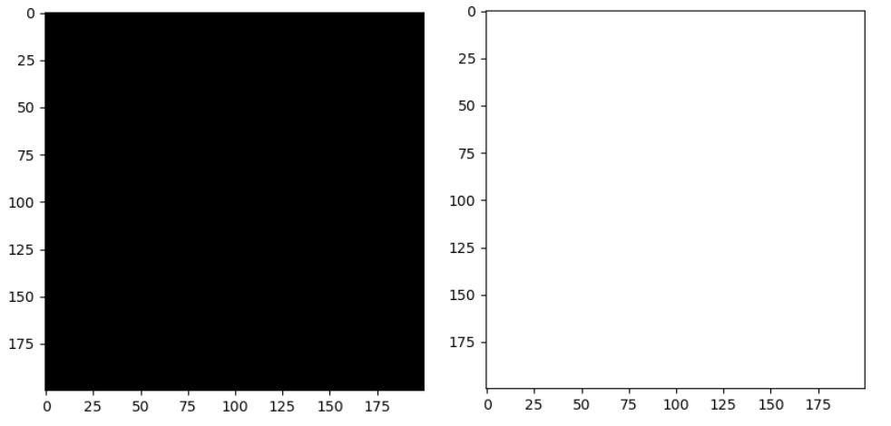

图像的形状为：

```python
图像的形状（H，W，C）:
 (640, 640, 3)
```


## 卷积神经网络（CNN）概述

###  什么是卷积神经网络

**卷积神经网络是深度学习在计算机视觉领域的突破性成果，专门用于处理图像、视频、语音等数据的神经网络** 

在计算机视觉领域, 往往我们输入的图像都很大，使用全连接网络的话，计算的代价较高。另外图像也很难保留原有的特征，导致图像处理的准确率不高。

卷积神经网络（Convolutional Neural Network）是**含有卷积层的神经网络**。卷积层的**作用就是用来自动学习、提取图像的特征**。

CNN网络主要由三部分构成：**卷积层、池化层和全连接层**构成：

（1）卷积层负责提取图像中的局部特征

（2）池化层用来大幅降低参数量级(降维)

（3）全连接层类似人工神经网络的部分，用来输出想要的结果

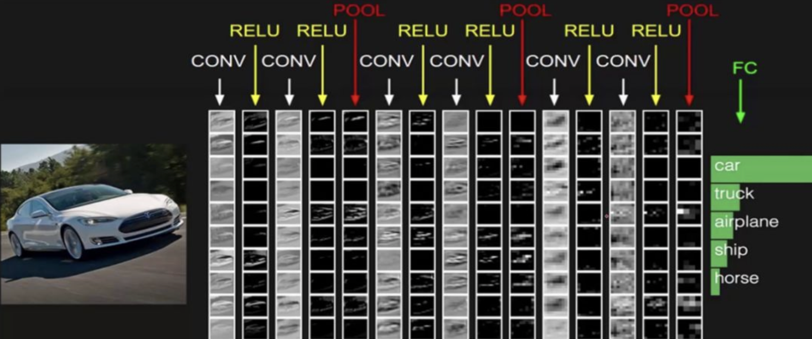

上图中CNN要做的事情是：给定一张图片，是车还是马未知，是什么车也未知，现在需要模型判断这张图片里具体是一个什么东西，总之输出一个结果：如果是车，那是什么车

- 最左边是
  - 数据输入层：对数据做一些处理，比如去均值（各维度都减对应维度的均值，使得输入数据各个维度都中心化为0，避免数据过多偏差，影响训练效果）、归一化（把所有的数据都归一到同样的范围）、PCA等等。CNN只对训练集做“去均值”这一步。
- 中间是
  - 卷积层(CONV)：线性乘积求和，提取图像中的局部特征
  - 激励层(RELU)：ReLU激活函数,输入数据转换成输出数据
  - 池化层(POOL)：取区域平均值或最大值，大幅降低参数量级(降维)
- 最右边是
  - 全连接层(FC)：接收二维数据集，输出CNN模型预测结果

### 卷积神经网络应用

**图像分类**：最常见的应用，例如识别图片中的物体类别

**目标检测**：检测图像中物体的位置和类别

**图像分割**：将图像分成多个区域，用于语义分割

**人脸识别**：识别图像中的人脸

**医学图像分析**：用于检测医学图像中的异常（如癌症检测、骨折检测等）

**自动驾驶**：用于识别交通标志、车辆、行人

###  **CNN中的经典算法/网络架构**

**LeNet-5:**作为最早的CNN架构之一，证明了CNN在图像识别任务上的有效性，为后续的CNN发展奠定了基础

- **卷积层:** 提取图像的边缘、角点等基本特征
- **池化层 (子采样层):** 降低特征图的维度，减少计算量，并提高模型对输入图像微小变化的鲁棒性
- **全连接层:** 将卷积层和池化层提取的特征进行组合，用于最终的分类

**AlexNet:**显著提升了ImageNet图像分类的准确率，证明了深度学习在计算机视觉领域的潜力，并推动了深度学习的快速发展

- **卷积层:** 使用更大的卷积核和更多的卷积核，提取更丰富的图像特征
- **ReLU激活函数:** 加速训练过程，并提高模型的性能
- **最大池化层:** 降低特征图的维度
- **Dropout层:** 防止过拟合
- **全连接层:** 用于最终的分类

**VGGNet:**探索了网络深度对性能的影响，证明了更深的网络可以提取更抽象和更具表达力的特征

- **卷积层:** 使用更小的卷积核 (3x3)，并堆叠多个卷积层，增加了网络的深度，提取更复杂的特征
- **最大池化层:** 降低特征图的维度
- **全连接层:** 用于最终的分类

**GoogLeNet (Inception):**提出了 Inception 模块，在提高性能的同时减少了计算量，为后续的网络架构设计提供了新的思路

- **Inception 模块:** 并行使用不同大小的卷积核和池化操作，然后将它们的输出连接起来，增加了网络的宽度，提高了网络的效率

**ResNet:**解决了深度网络训练困难的问题，使得可以训练更深的网络，从而显著提高了模型的性能

- **残差块 (Residual Block):** 引入跳跃连接 (Shortcut Connection)，允许梯度直接反向传播到浅层，解决了深度网络的梯度消失问题，使得训练非常深的网络成为可能

**DenseNet:**

- **密集块 (Dense Block):** 将每一层都与之前的所有层连接，特征重用更加充分，进一步提高了网络的性能和参数效率
- DenseNet通过密集连接（Dense Connectivity）在网络中各层之间建立了直接的连接，即每一层都接收前面所有层的输出作为输入。这种设计增强了特征传递和梯度流动，避免了梯度消失问题，并提高了信息的利用率

##  卷积层

> 卷积层（Convolutional Layer）通过卷积操作提取输入数据中的特征（例如图像中的边缘、纹理、形状等）。
>
> 卷积层利用卷积核（滤波器）对输入进行处理，从而生成特征图（feature map），并且每个卷积层能够提取不同层次的特征，从低级特征（如边缘）到高级特征（如物体的形状）。
>
> **卷积层的主要作用如下：**
>
> - **特征提取**：卷积层的主要作用是从输入图像中提取低级特征（如边缘、角点、纹理等）。通过多个卷积层的堆叠，网络能够逐渐从低级特征到高级特征（如物体的形状、区域等）进行学习。
>
> - **权重共享**：在卷积层中，同一个卷积核在整个输入图像上共享权重，这使得卷积层的参数数量大大减少，减少了计算量并提高了训练效率。
>
> - **局部连接**：卷积层中的每个神经元仅与输入图像的一个小局部区域相连，这称为**局部感受野**，这种局部连接方式更符合图像的空间结构，有助于捕捉图像中的局部特征。
>
> - **空间不变性**：由于卷积操作是局部的并且采用权重共享，卷积层在处理图像时具有**平移不变性**。也就是说，不论物体出现在图像的哪个位置，卷积层都能有效地检测到这些物体的特征。

### 卷积计算

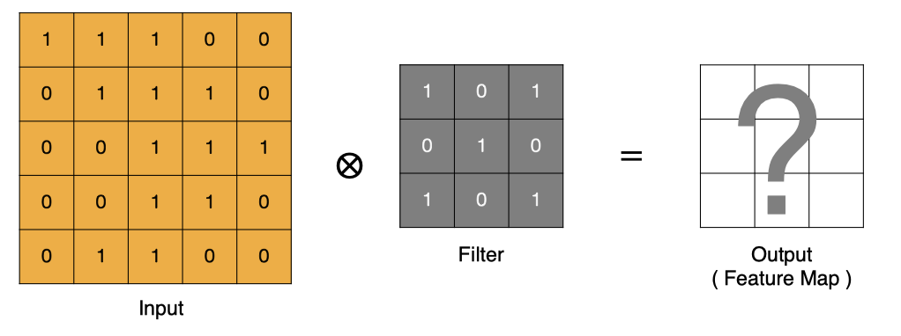

1. input 表示输入的图像

2. filter 表示卷积核, 也叫做滤波器(滤波矩阵)

   - 一组固定的权重，因为每个神经元的多个权重固定，所以又可以看做一个恒定的滤波器filter
   - 非严格意义上来讲，下图中红框框起来的部分便可以理解为一个滤波器，即带着**一组固定权重的神经元**。多个滤波器叠加便成了卷积层
   - 一个卷积核就是一个神经元

   

3. input 经过 filter 得到输出为最右侧的图像，该图叫做特征图

那么, 它是如何进行计算的呢？**卷积运算本质上就是在滤波器和输入数据的局部区域间做点积。**

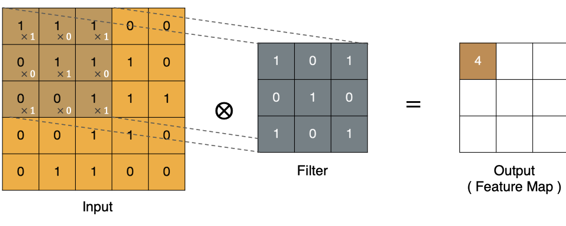

左上角的点计算方法：

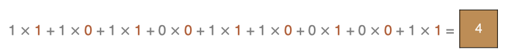

按照上面的计算方法可以得到最终的特征图为:

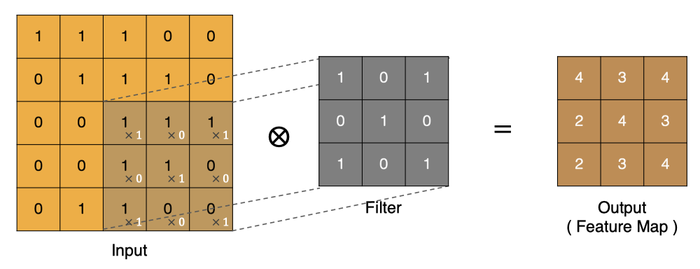

图像上的卷积:

在下图对应的计算过程中，输入是一定区域大小(width*height)的数据，和滤波器filter（带着一组固定权重的神经元）做内积后得到新的二维数据。


具体来说，左边是图像输入，中间部分就是滤波器filter（带着一组固定权重的神经元），不同的滤波器filter会得到不同的输出数据，比如颜色深浅、轮廓。相当于如果想提取图像的不同特征，则用不同的滤波器filter，提取想要的关于图像的特定信息：颜色深浅或轮廓。

### Padding（填充）

通过上面的卷积计算过程，最终的特征图比原始图像小很多，如果想要保持经过卷积后的图像大小不变, 可以在**原图周围**添加 Padding 来实现。

Padding（填充）操作是一种用于==在输入特征图的边界周围添加额外像素（通常是零）==。

**Padding的主要作用：**

- **保持空间维度：**如果不使用 padding，每次卷积操作后，特征图的尺寸都会缩小。多次卷积后，特征图会变得非常小，可能会丢失重要的边缘信息。Padding可以帮助维持输出特征图的尺寸与输入相同或接近相同。
- **保留边缘信息：**图像边缘的像素在卷积过程中参与的计算次数较少，这意味着边缘信息在特征提取过程中容易丢失。Padding通过在边缘添加额外的像素，增加了边缘像素的参与度，从而更好地保留了边缘信息。
- **提高性能：**Padding有助于避免由于特征图尺寸快速缩小而导致的信息丢失，从而提高模型的性能，尤其是在处理较小的图像或需要进行多层卷积时。

**Padding的类型：**

- **Valid Padding (No Padding):** 不进行任何填充。卷积核只在输入图像的有效区域内滑动。输出尺寸会缩小。 
- **Same Padding:** 添加足够的填充，使得输出特征图的尺寸与输入相同。 
- **Full Padding:** 尽可能多地添加填充，使得卷积核的每个元素都至少在输入图像上滑动一次。输出尺寸会增大。

**Padding的选择：**取决于具体的应用场景和网络架构

- **Valid Padding:** 适用于不需要保持输出尺寸的场景，或者输入图像足够大，边缘信息丢失不重要的情况。
- **Same Padding:** 广泛应用于各种CNN架构中，因为它可以保持特征图的尺寸，方便网络设计和计算。
- **Full Padding:** 较少使用，因为它会增加计算量，并且可能会在边缘引入一些伪影。

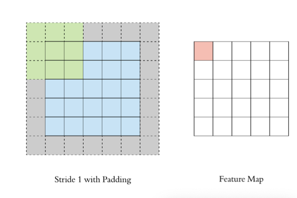

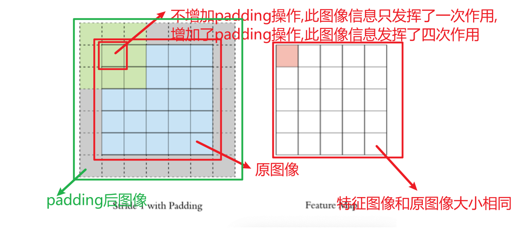

### Stride（步长）

Stride（步长）指的是**卷积核在图像上滑动时的步伐大小**，即每次卷积时卷积核在图像中向右（或向下）移动的像素数。步长直接影响卷积操作后输出特征图的尺寸，以及计算量和模型的特征提取能力。

**Stride的作用:**

- **降低计算复杂度：**更大的步长意味着卷积核移动的次数更少，从而减少了计算量，并加快了训练和推理速度。
- **减1长越大，生成的特征图尺寸越小。这类似于池化的降维效果。
- **增大感受野：**虽然更大的步长会减小特征图的尺寸，但它同时也会增大每个神经元在输入数据上的感受野。这意味着每个神经元能够捕捉到更大范围的输入信息。

**Stride的选择：**取决于具体的应用场景和网络架构

- **Stride = 1:** 这是最常见的设置，尤其是在网络的早期层。它允许保留更多的空间细节。
- **Stride > 1:** 通常用于减小特征图的尺寸和增大感受野，例如在网络的后期层或需要进行快速降维时。 常见的设置包括 stride=2 或 stride=4。

按照步长为1来移动卷积核，计算特征图如下所示：

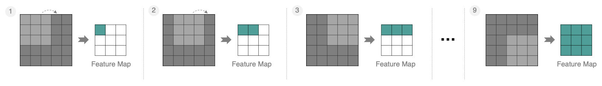

如果把Stride增大为2，也是可以提取特征图的，如下图所示：

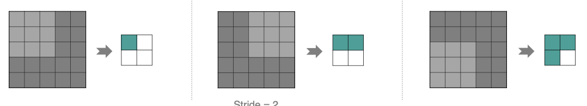

###  多通道卷积计算

实际中的图像都是多个通道组成的，我们怎么计算卷积呢？

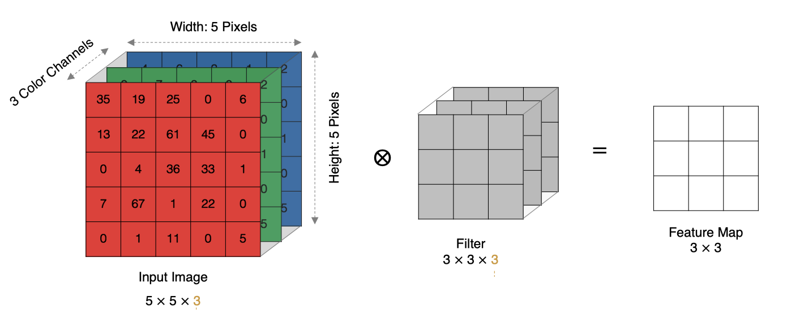

计算方法如下：

1. 当输入有多个通道(Channel), 例如 RGB 三个通道, 此时要求卷积核需要拥有相同的通道数（图像有多少通道，每个卷积核就有多少通道）.
2. 每个卷积核通道与对应的输入图像的各个通道进行卷积.
3. 将每个通道的卷积结果按位相加得到最终的特征图.

如下图所示:

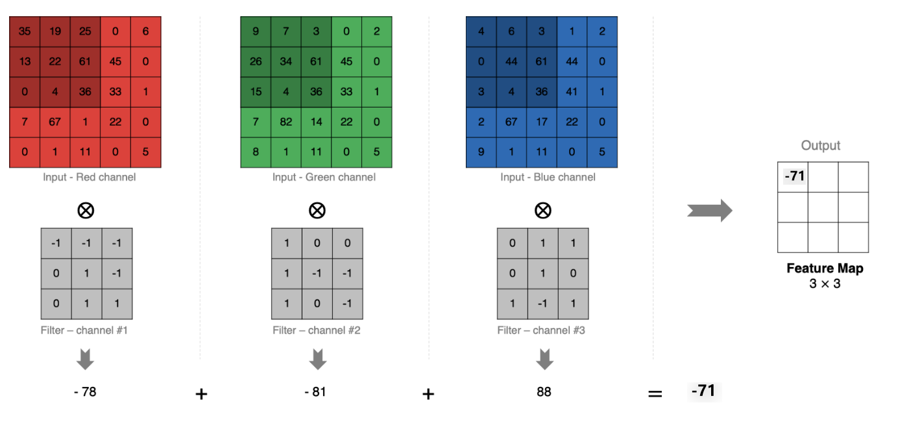

### 多卷积核卷积计算

上面的例子里我们只使用一个卷积核进行特征提取, 实际对图像进行特征提取时, 我们需要使用多个卷积核进行特征提取. 这个多个卷积核可以理解为从不同到的视角、不同的角度对图像特征进行提取.

那么, 当使用多个卷积核时, 应该怎么进行特征提取呢?

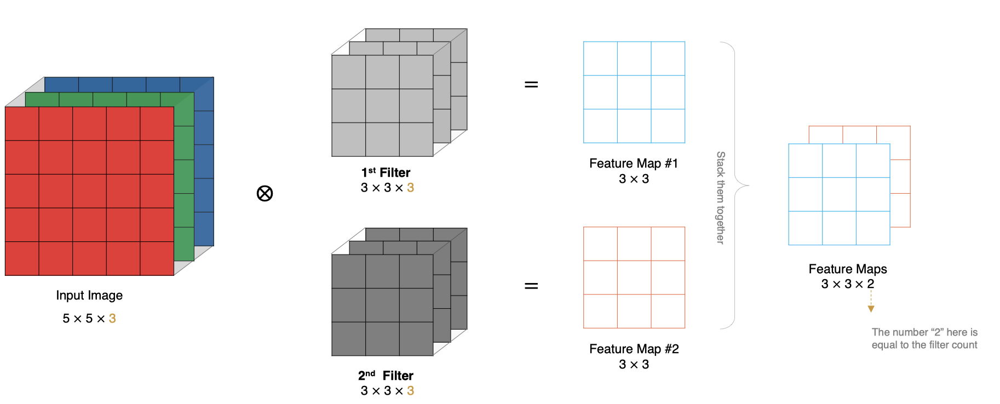

通过以下例子查看多卷积核卷积计算流程:


可以看到：

- 两个神经元，意味着有两个滤波器
- 数据窗口每次移动两个步长取3*3的局部数据，即stride=2
- zero-padding=1。输入数据由`5*5*3`变为`7*7*3`
- 左边是输入（**7\*7\*3**中，7*7代表图像的像素/长宽，3代表R、G、B 三个颜色通道）
- 中间部分是两个不同的滤波器Filter w0、Filter w1
- 最右边则是两个不同的输出

### 特征图大小

输出特征图的大小与以下参数息息相关:

1. size: 卷积核/过滤器大小，一般会选择为奇数，比如有 `1*1`, `3*3`， `5*5`
2. Padding: 零填充的方式 
3. Stride: 步长

那计算方法如下图所示:

1. 输入图像大小: W x W
2. 卷积核大小: F x F
3. Stride: S
4. Padding: P
5. 输出图像大小: N x N


以下图为例:

1. 图像大小: 5 x 5
2. 卷积核大小: 3 x 3
3. Stride: 1
4. Padding: 1
5. (5 - 3 + 2) / 1 + 1 = 5（如果除不尽向下取整）, 即得到的特征图大小为: 5 x 5


###  PyTorch卷积层API

在PyTorch中进行卷积的API是：

```python
conv = nn.Conv2d(in_channels, out_channels, kernel_size, stride, padding)

"""
参数说明：
in_channels: 输入通道数，RGB图片一般是3
out_channels: 输出通道，也可以理解为卷积核kernel的数量
kernel_size：卷积核的高和宽设置，一般为3,5,7...
stride：卷积核移动的步长
	整数stride：表示在所有维度上使用相同的步长 stride=2 表示在水平和垂直方向上每次移动2个像素
	元组stride: 允许在不同维度上设置不同的步长 stride=(2, 1) 表示在水平方向上步长为2，在垂直方向上步长为1
padding：在四周加入padding的数量，默认补0
	padding=0：不进行填充。
	padding=1：在每个维度上填充 1 个像素（常用于保持输出尺寸与输入相同 padding=输入形状大小-输出形状大小）。
	padding='same'（从 PyTorch 1.9+ 开始支持）：让输出特征图的尺寸与输入保持一致。PyTorch会自动计算需要的填充量。stride必须等于1，不支持跨行，因为计算padding时可能出现小数
	padding=kernel_size-1：Full Padding 完全填充
"""
```

我们接下来对下面的图片进行特征提取:


下面演示多通道多卷积核卷积:

```python
import torch
import torch.nn as nn
import matplotlib.pyplot as plt

# 对图像进行卷积
# 1 读取图像 显示图像
# 2 定义卷积层
# 3 变换数据形状 1-转成tensor 2-通道要求[C H W] 3-批次数要求 [batch, C, H, W]
# 4 给卷积层喂数据 [1, 3, 640, 640] ---> [1, 4, 319, 319])
# (H-F+2p)/s +1 = (640-3+0)/2 + 1 = 319.5向下取整319
def test01():

    # 1 读取图像
    img = plt.imread('./data/img.jpg')
    print('img.shape', img.shape)

    plt.imshow(img)
    plt.show()

    # 2 定义卷积层
    myconv2d = nn.Conv2d(in_channels=3, out_channels=4, kernel_size=3, stride=2, padding=0)
    print('myconv2d--->', myconv2d)

    # 3 变换数据形状 
	# ①转换成tensor
    # ②通道要求[C, H, W], 默认[H, W, C]
    # ③批次数要求[batch, C, H, W],多少个图像(一个图像是三维数组,四维有多少个三维就是多少个图像)
    # [0, 1, 2] --> [2, 0, 1]
    img2 = torch.tensor(img).permute(2, 0, 1)
    print('img2.shape--->', img2.shape)
	# 图像数为1,变为4维张量
    img3 = img2.unsqueeze(0)
    print('img3.shape--->', img3.shape)

    # 4 给卷积层喂数据 [1, 3, 640, 640] ---> [1, 4, 319, 319])
    # (H-F+2p)/s + 1 = (640-3+0)/2 + 1 = 319.5向下取整319
    img4 = myconv2d(img3.type(torch.float32))
    print('img4-->', img4.shape)


if __name__ == '__main__':
    test01()
```

**输出结果:**

```python
img.shape---> (640, 640, 3)
myconv2d---> Conv2d(3, 4, kernel_size=(3, 3), stride=(2, 2))
img2.shape---> torch.Size([3, 640, 640])
img3.shape---> torch.Size([1, 3, 640, 640])
img4--> torch.Size([1, 4, 319, 319])
```

对生成的特征图进行显示:

```python
# 对图像卷积 并显示卷积以后的特征图
# 思路：去掉批次数 -> 转成[HWC] -->按照通道拿数据[:,:,0123]
def test02():

    # 1 读取图像
    img = plt.imread('./data/img.jpg')
    print('img.shape', img.shape)

    plt.imshow(img)
    plt.show()

    # 2 定义卷积层
    myconv2d = nn.Conv2d(in_channels=3, out_channels=4, kernel_size=3, stride=2, padding=0)
    print('myconv2d--->', myconv2d)

    # 3 变换数据形状 1-转成tensor 2-通道要求[C H W] 3-批次数要求 [batch, C, H, W]
    # [0, 1, 2] --> [2, 0, 1]
    img2 = torch.tensor(img).permute(2, 0, 1)
    print('img2.shape--->', img2.shape)

    img3 = img2.unsqueeze(0)
    print('img3.shape--->', img3.shape)

    # 4 给卷积层喂数据 [1, 3, 640, 640] ---> [1, 4, 319, 319])
    # (H-F+2p)/s +1 = (640-3+0)/2 + 1 = 319.5向下取整319
    img4 = myconv2d(img3.type(torch.float32))
    print('img4-->', img4.shape)

    # 5 查看特征图思路：去掉批次数 -> 转成[HWC] -->按照通道拿数据[:,:,0123]
    img5 = img4[0] # 去掉批次数
    print('去掉批次数img5.shape-->', img5.shape)
    img6 = img5.permute(1, 2, 0)
    print('去掉批次数以后，再进行HWC img6.shape-->', img6.shape)

    feature1 = img6[:, :, 0].detach().numpy()
    feature2 = img6[:, :, 1].detach().numpy()
    feature3 = img6[:, :, 2].detach().numpy()
    feature4 = img6[:, :, 3].detach().numpy()

    plt.imshow(feature1)
    plt.show()

    plt.imshow(feature2)
    plt.show()

    plt.imshow(feature3)
    plt.show()

    plt.imshow(feature4)
    plt.show()

    
if __name__ == '__main__':
    test02()
```

**生成特征图显示:**

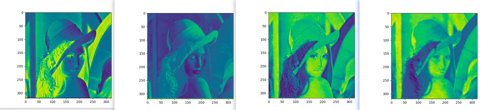

## 池化层

> 池化层（Pooling Layer）是用于降低输入数据的空间维度（例如图像的高度和宽度），从而减少计算量、减少内存消耗，并提高模型的鲁棒性。
>
> 池化层通常位于卷积层之后，它通过对卷积层输出的特征图进行下采样，保留最重要的特征信息，同时丢弃一些不重要的细节。
>
> **池化层的主要作用如下:**
>
> - **降维和计算量减少**：池化层通过减少特征图的尺寸，从而降低了计算量，特别是在多层网络中，随着层数的增加，池化能够显著减少计算资源的消耗。
>
> - **提高鲁棒性**：池化操作可以使得特征对小的变换、平移和旋转变得更加不敏感。这样，模型在面对噪声或图像的轻微变化时，依然能够稳定工作。
>
> - **防止过拟合**：通过池化减少了特征图的大小，减少了模型的复杂度，从而有助于防止过拟合，尤其是在较小的数据集上。
>
> - **抽象特征**：通过池化层的操作，可以提取更为抽象和高层次的特征，使得网络能够学习到更具泛化能力的表示。

### 池化层计算

- 最大池化(Max Pooling) ：通过池化窗口进行最大池化，**取窗口中的最大值作为输出**

  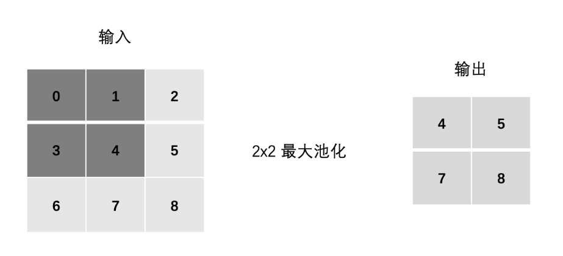

- 平均池化(Avg Pooling) ：**取窗口内的所有值的均值作为输出**

  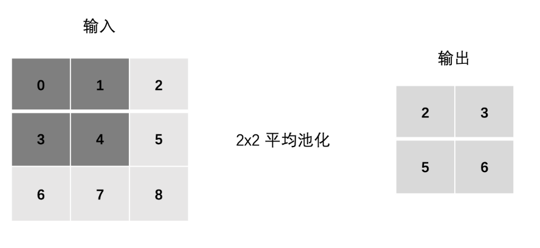

### Padding（填充）

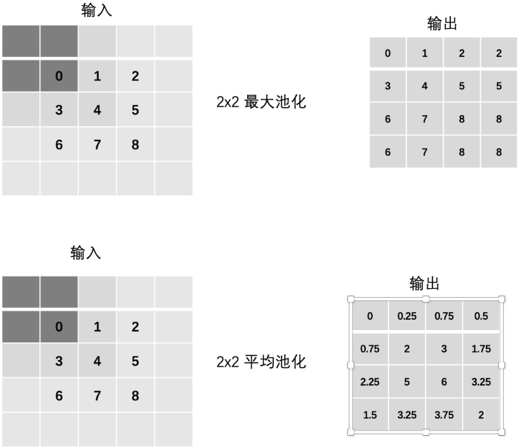

### Stride（步长）

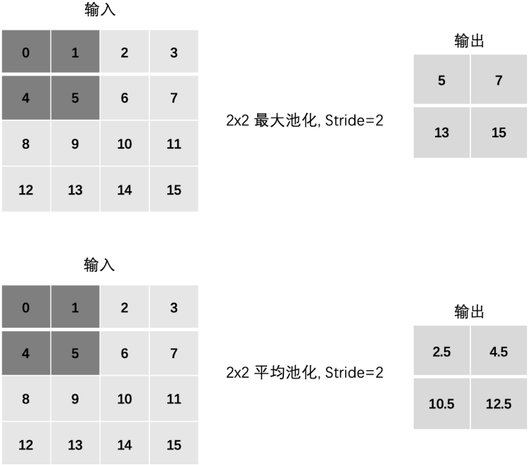


### 多通道池化计算

在处理多通道输入数据时，池化层对每个输入通道分别池化，而不是像卷积层那样将各个通道的输入相加。这意味着==池化层的输出和输入的通道数是相等。==

**池化只在宽高维度上池化**，**在通道上是不发生池化**（池化前后，多少个通道还是多少个通道）

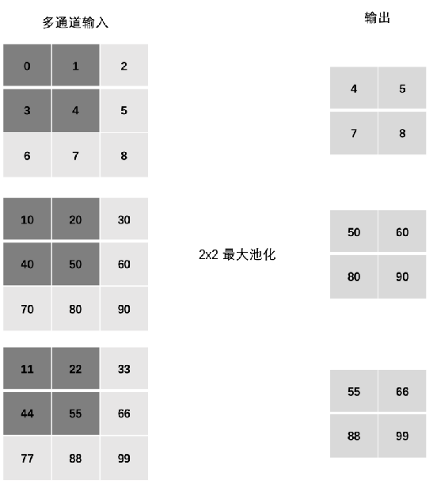

### PyTorch池化层API

在PyTorch中进行池化的API是：

```python
# 最大池化
nn.MaxPool2d(kernel_size=2, stride=2, padding=1)
# 平均池化
nn.AvgPool2d(kernel_size=2, stride=1, padding=0)
"""
参数说明：
kernel_size：核的高和宽设置，一般为3,5,7...
stride：核移动的步长
padding：在四周加入padding的数量，默认补0
"""
```

- 单通道池化

  ```python
  import torch
  import torch.nn as nn
  
  
  # 1. 单通道池化
  # 定义输入数据 [1,3,3]
  inputs = torch.tensor([[[0, 1, 2], [3, 4, 5], [6, 7, 8]]], dtype=torch.float)
  # 修改stride，padding观察效果
  # 1. 最大池化
  pooling = nn.MaxPool2d(kernel_size=2, stride=1, padding=0)
  output = pooling(inputs)
  print("最大池化：\n", output)
  # 2. 平均池化
  pooling = nn.AvgPool2d(kernel_size=2, stride=1, padding=0)
  output = pooling(inputs)
  print("平均池化：\n", output)
  ```

  **输出结果:**

  ```python
  最大池化：
   tensor([[[4., 5.],
           [7., 8.]]])
  平均池化：
   tensor([[[2., 3.],
           [5., 6.]]])
  ```

- 多通道池化

  ```python
  # 2. 多通道池化
  # 定义输入数据 [3,3,3]
  inputs = torch.tensor([[[0, 1, 2], [3, 4, 5], [6, 7, 8]],
                         [[10, 20, 30], [40, 50, 60], [70, 80, 90]],
                         [[11, 22, 33], [44, 55, 66], [77, 88, 99]]], dtype=torch.float)
  # 最大池化
  pooling = nn.MaxPool2d(kernel_size=2, stride=1, padding=0)
  output = pooling(inputs)
  print("多通道池化：\n", output)
  ```

  **输出结果:**

  ```python
  多通道池化：
   tensor([[[ 4.,  5.],
           [ 7.,  8.]],
  
          [[50., 60.],
           [80., 90.]],
  
          [[55., 66.],
           [88., 99.]]])
  ```

## 图像分类案例

> 咱们使用前面学习到的知识来构建一个卷积神经网络, 并训练该网络实现图像分类。要完成这个案例，咱们需要学习的内容如下:
> 了解 CIFAR10 数据集
> 搭建卷积神经网络
> 编写训练函数
> 编写预测函数

导入工具包

```python
import torch
import torch.nn as nn
from torchvision.datasets import CIFAR10
from torchvision.transforms import ToTensor  # pip install torchvision -i https://mirrors.aliyun.com/pypi/simple/
import torch.optim as optim
from torch.utils.data import DataLoader
import time
import matplotlib.pyplot as plt
from torchsummary import summary

# 每批次样本数
BATCH_SIZE = 8
```

### CIFAR10 数据集

CIFAR-10数据集5万张训练图像、1万张测试图像、10个类别、每个类别有6k个图像，图像大小32×32×3。下图列举了10个类，每一类随机展示了10张图片：

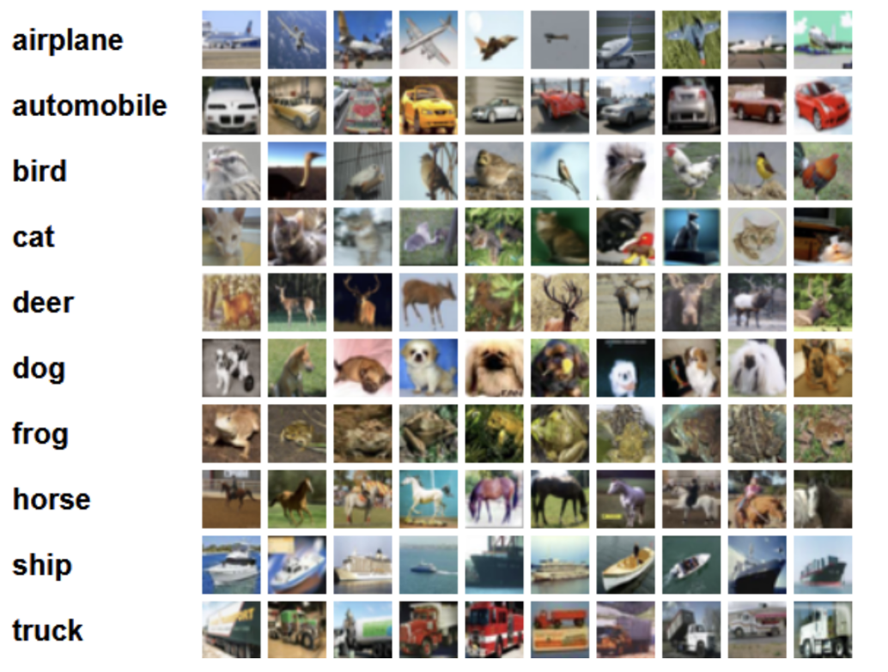

PyTorch 中的 torchvision.datasets 计算机视觉模块封装了 CIFAR10 数据集, 使用方法如下:

```python
# 1. 数据集基本信息
def create_dataset():
    # 加载数据集:训练集数据和测试数据
    # ToTensor: 将image（一个PIL.Image对象）转换为一个Tensor
    train = CIFAR10(root='data', train=True, transform=ToTensor())
    valid = CIFAR10(root='data', train=False, transform=ToTensor())
    # 返回数据集结果
    return train, valid


if __name__ == '__main__':
    # 数据集加载
    train_dataset, valid_dataset = create_dataset()
    # 数据集类别
    print("数据集类别:", train_dataset.class_to_idx)
    # 数据集中的图像数据
    print("训练集数据集:", train_dataset.data.shape)
    print("测试集数据集:", valid_dataset.data.shape)
    # 图像展示
    plt.figure(figsize=(2, 2))
    plt.imshow(train_dataset.data[1])
    plt.title(train_dataset.targets[1])
    plt.show()
```

**输出结果：**

```python
数据集类别: {'airplane': 0, 'automobile': 1, 'bird': 2, 'cat': 3, 'deer': 4, 'dog': 5, 'frog': 6, 'horse': 7, 'ship': 8, 'truck': 9} 
训练集数据集: (50000, 32, 32, 3) 
测试集数据集: (10000, 32, 32, 3)
```

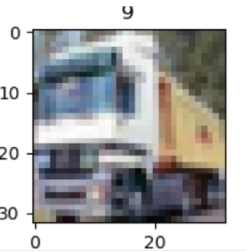

### 搭建图像分类网络

搭建的CNN网络结构如下:

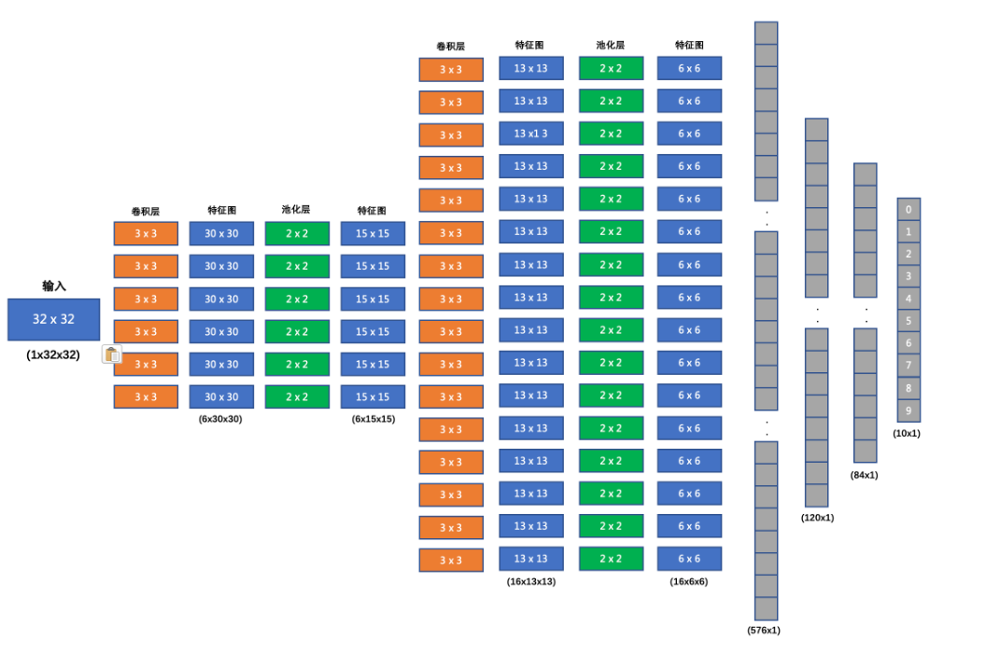

我们要搭建的网络结构如下:

1. 输入形状: 32x32
2. 第一个卷积层输入 3 个 Channel, 输出 6 个 Channel, Kernel Size 为: 3x3
3. 第一个池化层输入 30x30, 输出 15x15, Kernel Size 为: 2x2, Stride 为: 2
4. 第二个卷积层输入 6 个 Channel, 输出 16 个 Channel, Kernel Size 为 3x3
5. 第二个池化层输入 13x13, 输出 6x6, Kernel Size 为: 2x2, Stride 为: 2
6. 第一个全连接层输入 576 维, 输出 120 维
7. 第二个全连接层输入 120 维, 输出 84 维
8. 最后的输出层输入 84 维, 输出 10 维

我们在每个卷积计算之后应用 relu 激活函数来给网络增加非线性因素。

**构建网络代码实现如下:**

```python
# 模型构建
class ImageClassification(nn.Module):
    # 定义网络结构
    def __init__(self):
        super(ImageClassification, self).__init__()
        # 定义网络层：卷积层+池化层
        # 第一个卷积层, 输入图像为3通道,输出特征图为6通道,卷积核3*3
        self.conv1 = nn.Conv2d(3, 6, stride=1, kernel_size=3)
        # 第一个池化层, 核宽高2*2
        self.pool1 = nn.MaxPool2d(kernel_size=2, stride=2)
        # 第二个卷积层, 输入图像为6通道,输出特征图为16通道,卷积核3*3
        self.conv2 = nn.Conv2d(6, 16, stride=1, kernel_size=3)
        # 第二个池化层, 核宽高2*2
        self.pool2 = nn.MaxPool2d(kernel_size=2, stride=2)
        # 全连接层
        # 第一个隐藏层 输入特征576个(一张图像为16*6*6), 输出特征120个
        self.linear1 = nn.Linear(576, 120)
        # 第二个隐藏层
        self.linear2 = nn.Linear(120, 84)
        # 输出层
        self.out = nn.Linear(84, 10)
        
	# 定义前向传播
    def forward(self, x):
        # 卷积+relu+池化
        x = torch.relu(self.conv1(x))
        x = self.pool1(x)
        # 卷积+relu+池化
        x = torch.relu(self.conv2(x))
        x = self.pool2(x)
        # 将特征图做成以为向量的形式：相当于特征向量 全连接层只能接收二维数据集
        # 由于最后一个批次可能不够8，所以需要根据批次数量来改变形状
        # x[8, 16, 6, 6] --> [8, 576] -->8个样本,576个特征
        # x.size(0): 第1个值是样本数 行数
        # -1：第2个值由原始x剩余3个维度值相乘计算得到 列数(特征个数)
        x = x.reshape(x.size(0), -1)
        # 全连接层
        x = torch.relu(self.linear1(x))
        x = torch.relu(self.linear2(x))
        # 返回输出结果
        return self.out(x)


if __name__ == '__main__':
    # 模型实例化
    model = ImageClassification()
    summary(model, input_size=(3,32,32), batch_size=1)
```

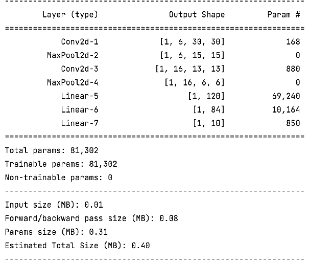

### 编写训练函数

在训练时，使用多分类交叉熵损失函数，Adam 优化器。具体实现代码如下:

```python
def train(model, train_dataset):
    # 构建数据加载器
    dataloader = DataLoader(train_dataset, batch_size=BATCH_SIZE, shuffle=True)
    criterion = nn.CrossEntropyLoss() # 构建损失函数
    optimizer = optim.Adam(model.parameters(), lr=1e-3) # 构建优化方法
    epoch = 100  # 训练轮数
    for epoch_idx in range(epoch):
        sum_num = 0   # 样本数量
        total_loss = 0.0  # 损失总和
        correct = 0  # 预测正确样本数
        start = time.time()  # 开始时间
        # 遍历数据进行网络训练
        for x, y in dataloader:
            model.train()
            output = model(x)
            loss = criterion(output, y)  # 计算损失
            optimizer.zero_grad()  # 梯度清零
            loss.backward()  # 反向传播
            optimizer.step()  # 参数更新
            correct += (torch.argmax(output, dim=-1) == y).sum()  # 计算预测正确样本数
            # 计算每次训练模型的总损失值 loss是每批样本平均损失值
            total_loss += loss.item()*len(y)  # 统计损失和
            sum_num += len(y)
        print('epoch:%2s loss:%.5f acc:%.2f time:%.2fs' %(epoch_idx + 1,total_loss / sum_num,correct / sum_num,time.time() - start))
    # 模型保存
    torch.save(model.state_dict(), 'model/image_classification.pth')
            

if __name__ == '__main__':
    # 数据集加载
    train_dataset, valid_dataset = create_dataset()
    # 模型实例化
    model = ImageClassification()
    # 模型训练
    train(model,train_dataset)
```

**输出结果：**

```python
epoch: 1 loss:1.59926 acc:0.41 time:28.97s
epoch: 2 loss:1.32861 acc:0.52 time:29.98s
epoch: 3 loss:1.22957 acc:0.56 time:29.44s
epoch: 4 loss:1.15541 acc:0.59 time:30.45s
epoch: 5 loss:1.09832 acc:0.61 time:29.69s
...
epoch:96 loss:0.30592 acc:0.89 time:37.28s
epoch:97 loss:0.29255 acc:0.90 time:37.11s
epoch:98 loss:0.29470 acc:0.90 time:36.98s
epoch:99 loss:0.29472 acc:0.90 time:36.79s
epoch:100 loss:0.29903 acc:0.90 time:37.66s
```

### 编写预测函数

加载训练好的模型，对测试集中的1万条样本进行预测，查看模型在测试集上的准确率。

```python
def test(valid_dataset):
    # 构建数据加载器
    dataloader = DataLoader(valid_dataset, batch_size=BATCH_SIZE, shuffle=False)
    # 加载模型并加载训练好的权重
    model = ImageClassification()
    model.load_state_dict(torch.load('model/image_classification.pth'))
    # 模型切换评估模式, 如果网络模型中有dropout/BN等层, 评估阶段不进行相应操作
    model.eval()
    # 计算精度
    total_correct = 0
    total_samples = 0
    # 遍历每个batch的数据，获取预测结果，计算精度
    for x, y in dataloader:
        output = model(x)
        total_correct += (torch.argmax(output, dim=-1) == y).sum()
        total_samples += len(y)
    # 打印精度
    print('Acc: %.2f' % (total_correct / total_samples))
    

if __name__ == '__main__':
    test(valid_dataset)
```

**输出结果：**

```python
Acc: 0.57
```

###  模型优化

CNN网络模型在训练集样本上的准确率远远高于测试集,说明模型产生了过拟合问题,我们把学习率由1e-3修改为1e-4、增加网络参数量和增加dropout正则化

```python
class ImageClassification(nn.Module):
	def __init__(self):
		super(ImageClassification, self).__init__()
		self.conv1 = nn.Conv2d(3, 32, stride=1, kernel_size=3)
		self.pool1 = nn.MaxPool2d(kernel_size=2, stride=2)
		self.conv2 = nn.Conv2d(32, 128, stride=1, kernel_size=3)
		self.pool2 = nn.MaxPool2d(kernel_size=2, stride=2)

		self.linear1 = nn.Linear(128 * 6 * 6, 2048)
		self.linear2 = nn.Linear(2048, 2048)
		self.out = nn.Linear(2048, 10)
		# Dropout层，p表示神经元被丢弃的概率
		self.dropout = nn.Dropout(p=0.5)

	def forward(self, x):
		x = torch.relu(self.conv1(x))
		x = self.pool1(x)
		x = torch.relu(self.conv2(x))
		x = self.pool2(x)
		# 由于最后一个批次可能不够 32，所以需要根据批次数量来 flatten
		x = x.reshape(x.size(0), -1)
		x = torch.relu(self.linear1(x))
		# dropout正则化
		# 训练集准确率远远高于测试准确率,模型产生了过拟合
		x = self.dropout(x)
		x = torch.relu(self.linear2(x))
		x = self.dropout(x)
		return self.out(x)
```

经过训练，模型在测试集的准确率由 0.57，提升到了 0.93，同学们也可以自己修改相应的网络结构、训练参数等来提升模型的性能。


